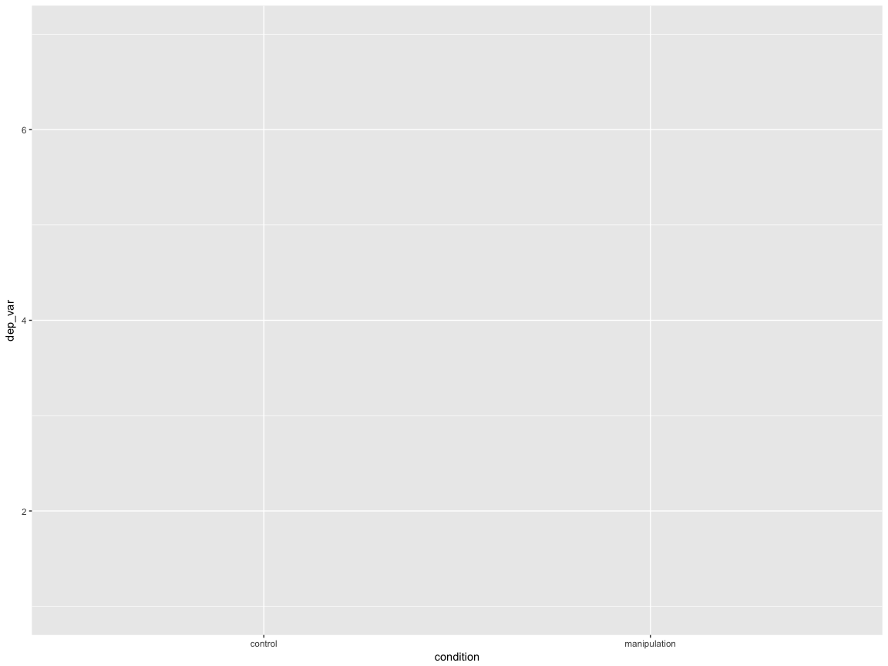
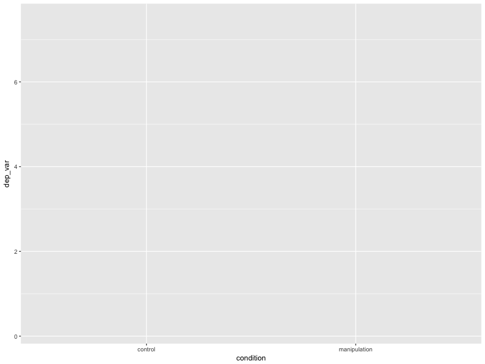
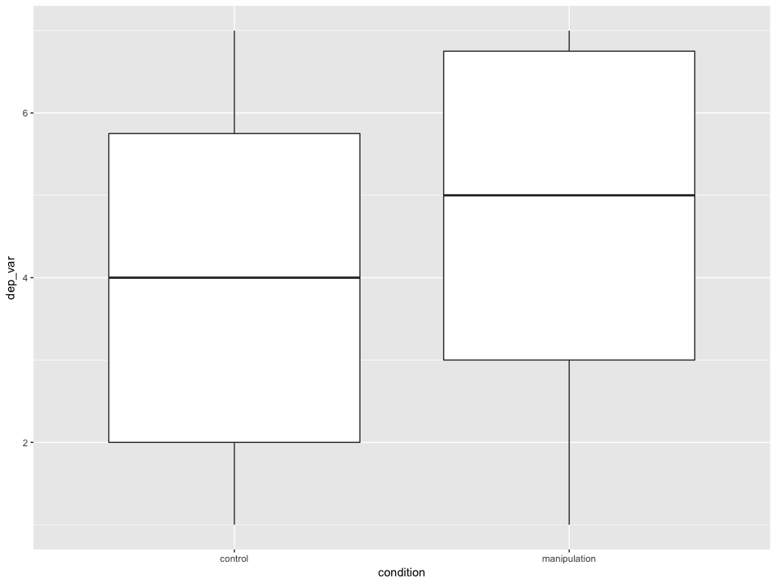
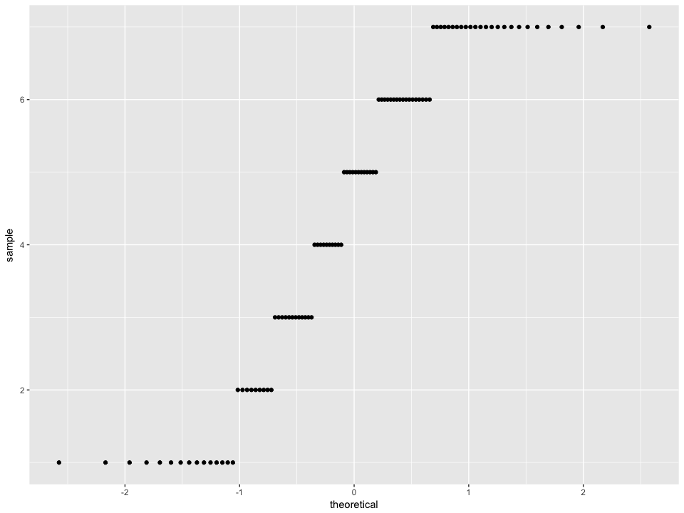
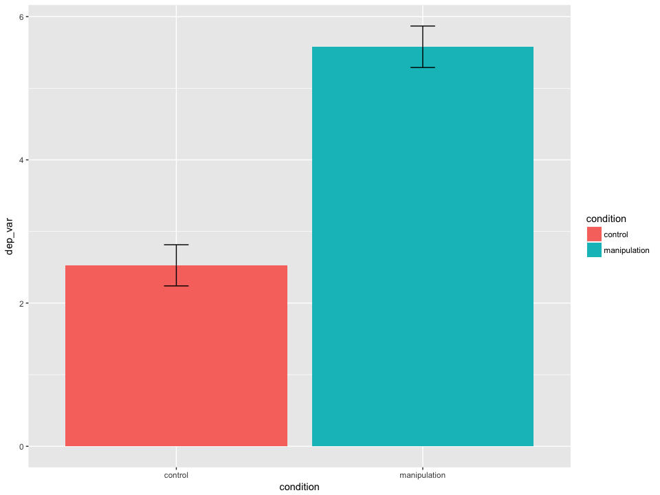
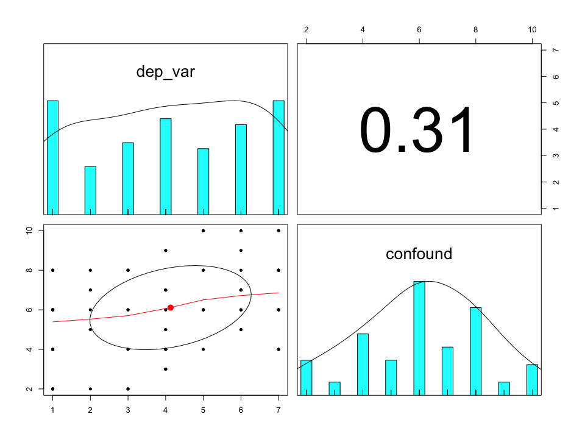

# learn R for psychology research: a crash course
Nicholas Michalak  
October 21, 2017  

# introduction
> I wrote this for psychologists who want to learn how to use R in their research **right now.** What does a psychologist need to know to use R to import, wrangle, plot, and model their data today? Here we go.

# foundations: resources that inspired me.
> * Dan Robinson (July 05, 2017) convinced me that beginneRs should learn tidyverse first, not Base R. I wrote this tutorial with this in mind. All you need to know about the differnece is in his blog post. If you've learned some R before this, you might understand that difference as you go through this tutorial.
> * If you want a more detailed introduction to R, start with R for Data Science (Wickham & Grolemund, 2017). The chapters are short, easy to read, and filled with simple coding examples that demonstrate big principles. And **it's free.**
> * Hadley Wickham is a legend in the R community. He's responsible for the tidyverse, including ggplot2. Read his books and papers (e.g., Wickham, 2014). Watch his talks (e.g., ReadCollegePDX, October 19, 2015). He's profoundly changed how people think about structuring and visualizing data.

## recommended resources
> * ReadCollegePDX (2015, October 19). Hadley Wickham "Data Science with R". Retrieved from https://youtu.be/K-ss_ag2k9E?list=PLNtpLD4WiWbw9Cgcg6IU75u-44TrrN3A4
> * Robinson, D. (2017, July 05). Teach the tidyverse to beginners. Variance Explained. Retreived from http://varianceexplained.org/r/teach-tidyverse/
> * Wickham, H. (2014). [Tidy data](http://vita.had.co.nz/papers/tidy-data.html). Journal of Statistical Software, 59(10), 1-23.
> * [The tidyverse style guide](http://style.tidyverse.org/) by Hadley Wickham
> * Wickham, H., & Grolemund, G. (2017). [R for Data Science: Import, Tidy, Transform, Visualize, and Model Data](http://r4ds.had.co.nz/). Sebastopol, CA: O'Reilly Media, Inc.

# need-to-know basics

## packages
> "Packages are collections of R functions, data, and compiled code in a well-defined format. The directory where packages are stored is called the library. R comes with a standard set of packages. Others are available for download and installation. Once installed, they have to be loaded into the session to be used." **Source:** https://www.statmethods.net/interface/packages.html


```r
# before you can load these libraries, use can need to install them first:
# install.packages(tidyverse)
# install.packages(haven)
# install.packages(psych)
# install.packages(car)

library(tidyverse)
library(haven)
library(psych)
library(car)
```

## objects
> "`object <- fuction(x)`, which means 'object is created from function(x)'. An object is anything created in R. It could be a variable, a collection of variables, a statistical model, etc. Objects can be single values (such as the mean of a set of scores) or collections of information; for example, when you run an analysis, you create an object that contains the output of that analysis, which means that this object contains many different values and variables. Functions are the things that you do in R to create your objects." **Source:** Field, A., Miles., J., & Field, Z. (2012). Discovering statistics using R. London: SAGE Publications.

## `c()` function
> "c" stands for combine. Use this to combine values into a vector. "A vector is a sequence of data 'elements' of the same basic type." **Source:** http://www.r-tutor.com/r-introduction/vector
> Below, we create an object called five_numbers. We are naming it for what it is, but we could name it whatever we want: some_numbers, maple_tree, platypus. It doesn't matter. We'll use this in the examples in later chunks of code.


```r
five_numbers <- c(1, 2, 3, 4, 5)

# print five_numbers by just excecuting/running the name of the object
five_numbers
```

```
## [1] 1 2 3 4 5
```

## R Help: `help()` and `?`
> "The help() function and ? help operator in R provide access to the documentation pages for R functions, data sets, and other objects, both for packages in the standard R distribution and for contributed packages. To access documentation for the standard lm (linear model) function, for example, enter the command help(lm) or help("lm"), or ?lm or ?"lm" (i.e., the quotes are optional)." **Source:** https://www.r-project.org/help.html

## piping, `%>%`
> The `%>%` operator allows you to "pipe" a value forward into an expression or function; something along the lines of x `%>%` f, rather than f(x). See http://magrittr.tidyverse.org/articles/magrittr.html for more details, but check out these examples below.

## compute z-scores for those five numbers, called five_numbers


```r
five_numbers %>% scale()
```

```
##            [,1]
## [1,] -1.2649111
## [2,] -0.6324555
## [3,]  0.0000000
## [4,]  0.6324555
## [5,]  1.2649111
## attr(,"scaled:center")
## [1] 3
## attr(,"scaled:scale")
## [1] 1.581139
```

## compute z-scores for five_numbers and then convert the result into only numbers


```r
five_numbers %>% scale() %>% parse_number()
```

```
## [1] -1.2649111 -0.6324555  0.0000000  0.6324555  1.2649111
```

## compute z-scores for five_numbers and then convert the result into only numbers and then compute the mean


```r
five_numbers %>% scale() %>% parse_number() %>% mean()
```

```
## [1] 0
```

## functions
> "A function is a piece of code written to carry out a specified task; it can or can not accept arguments or parameters and it can or can not return one or more values." Functions **do** things for you. **Source:** https://www.datacamp.com/community/tutorials/functions-in-r-a-tutorial#what

## compute the num of five_numbers


```r
five_numbers %>% sum()
```

```
## [1] 15
```

## compute the length of five_numbers


```r
five_numbers %>% length()
```

```
## [1] 5
```

## compute the sum of five_numbers and divide by the length of five_numbers


```r
five_numbers %>% sum() / five_numbers %>% length()
```

```
## [1] 3
```

## define a new function called compute_mean


```r
compute_mean <- function(some_numbers) {
  some_numbers %>% sum() / some_numbers %>% length()
}
```

## compute the mean of five_numbers


```r
five_numbers %>% compute_mean()
```

```
## [1] 3
```

# create data for psychology-like examples

## subject numbers


```r
subj_num <- seq(from = 1, to = 100, by = 1)

# print subj_num by just excecuting/running the name of the object
subj_num
```

```
##   [1]   1   2   3   4   5   6   7   8   9  10  11  12  13  14  15  16  17
##  [18]  18  19  20  21  22  23  24  25  26  27  28  29  30  31  32  33  34
##  [35]  35  36  37  38  39  40  41  42  43  44  45  46  47  48  49  50  51
##  [52]  52  53  54  55  56  57  58  59  60  61  62  63  64  65  66  67  68
##  [69]  69  70  71  72  73  74  75  76  77  78  79  80  81  82  83  84  85
##  [86]  86  87  88  89  90  91  92  93  94  95  96  97  98  99 100
```

## condition assignments


```r
condition <- c("control", "manipulation") %>% rep(each = 50) %>% factor()

# print condition by just excecuting/running the name of the object
condition
```

```
##   [1] control      control      control      control      control     
##   [6] control      control      control      control      control     
##  [11] control      control      control      control      control     
##  [16] control      control      control      control      control     
##  [21] control      control      control      control      control     
##  [26] control      control      control      control      control     
##  [31] control      control      control      control      control     
##  [36] control      control      control      control      control     
##  [41] control      control      control      control      control     
##  [46] control      control      control      control      control     
##  [51] manipulation manipulation manipulation manipulation manipulation
##  [56] manipulation manipulation manipulation manipulation manipulation
##  [61] manipulation manipulation manipulation manipulation manipulation
##  [66] manipulation manipulation manipulation manipulation manipulation
##  [71] manipulation manipulation manipulation manipulation manipulation
##  [76] manipulation manipulation manipulation manipulation manipulation
##  [81] manipulation manipulation manipulation manipulation manipulation
##  [86] manipulation manipulation manipulation manipulation manipulation
##  [91] manipulation manipulation manipulation manipulation manipulation
##  [96] manipulation manipulation manipulation manipulation manipulation
## Levels: control manipulation
```

## dependent measure

### create a vector of 7 values representing points on a 7-point scale


```r
scale_points <- seq(from = 1, to = 7, by = 1)

# print scale_points by just excecuting/running the name of the object
scale_points
```

```
## [1] 1 2 3 4 5 6 7
```

### how likely is each value, from 1 to 7?
> Below, I'm making a vector of 7 values for each condition that represent the "true" probablity of observing that value; I'll use this in a random sampling function in the next chunk of code.


```r
# all the 1s are divided by 7
control_probs <- c(1, 1, 1, 1, 1, 1, 1) / 7

# let's make bigger values more likely for the treatment condition
treatment_probs <- c(0.1, 0.1, 0.1, 0.1, 0.1, 0.2, 0.3)
```


### randomly sample from those points using the probability values we made above


```r
control_values <- scale_points %>% sample(size = 50, replace = TRUE, prob = control_probs)

treatment_values <- scale_points %>% sample(size = 50, replace = TRUE, prob = treatment_probs)
```

### combine those and save as our dependent variable


```r
dep_var <- c(control_values, treatment_values)

# print dep_var by just excecuting/running the name of the object
dep_var
```

```
##   [1] 5 7 1 7 6 4 7 4 4 3 7 4 7 4 5 5 4 4 5 1 1 3 6 5 7 1 6 2 3 4 5 2 5 5 1
##  [36] 5 1 7 1 6 1 1 2 3 4 5 3 1 2 6 7 1 7 6 7 6 1 6 1 6 2 7 4 6 7 6 1 2 4 6
##  [71] 7 1 3 6 2 3 7 3 6 7 4 4 1 3 1 7 7 7 4 4 3 7 1 5 2 1 4 3 3 6
```

## create a potentially confounding variable or a control variable
> read the code below like this: dep_var multiplied by 0.5 + the result of a random sample of 100 from scale_points, with replacement. Round this result to 0 digits.


```r
confound <- (dep_var * 0.5 + scale_points %>% sample(size = 100, replace = TRUE)) %>% round(digits = 0)

# print confound by just excecuting/running the name of the object
confound
```

```
##   [1]  8  6  8  8  8  6  6  7  4  2  4  3  4  3  8  4  5  7  8  6  6  6  6
##  [24]  6  8  8  7  6  8  6  6  2 10 10  6  6  2  6  4  6  6  2  5  4  9  6
##  [47]  8  4  8  6  6  2  8  7  8  7  8  9  4  5  5  4  4  7  8  7  6  7  4
##  [70]  5  8  6  2 10  7  4 10  8  5  6  5  3  4  6  6 10 10  4  7  9  6  6
##  [93]  2 10  8  8  7  2  8  5
```

## subject gender


```r
gender <- c("Woman", "Man") %>% rep(times = 50) %>% factor()

# print gender by just excecuting/running the name of the object
gender
```

```
##   [1] Woman Man   Woman Man   Woman Man   Woman Man   Woman Man   Woman
##  [12] Man   Woman Man   Woman Man   Woman Man   Woman Man   Woman Man  
##  [23] Woman Man   Woman Man   Woman Man   Woman Man   Woman Man   Woman
##  [34] Man   Woman Man   Woman Man   Woman Man   Woman Man   Woman Man  
##  [45] Woman Man   Woman Man   Woman Man   Woman Man   Woman Man   Woman
##  [56] Man   Woman Man   Woman Man   Woman Man   Woman Man   Woman Man  
##  [67] Woman Man   Woman Man   Woman Man   Woman Man   Woman Man   Woman
##  [78] Man   Woman Man   Woman Man   Woman Man   Woman Man   Woman Man  
##  [89] Woman Man   Woman Man   Woman Man   Woman Man   Woman Man   Woman
## [100] Man  
## Levels: Man Woman
```

## subject age


```r
age <- seq(from = 18, to = 25, by = 1) %>% sample(size = 100, replace = TRUE)

# print gender by just excecuting/running the name of the object
age
```

```
##   [1] 21 23 22 20 25 19 18 23 22 19 18 21 18 22 22 25 21 19 25 18 18 23 24
##  [24] 19 23 21 22 18 22 21 23 21 22 19 20 24 21 23 21 21 25 20 18 22 22 22
##  [47] 22 24 25 25 23 20 18 25 24 23 19 20 25 23 24 22 20 25 20 23 23 24 19
##  [70] 23 25 22 25 21 24 20 25 25 19 21 23 19 21 25 20 18 21 24 21 19 21 23
##  [93] 24 23 18 25 25 21 19 22
```

## `data.frame()` and `tibble()`
> "The concept of a data frame comes from the world of statistical software used in empirical research; it generally refers to "tabular" data: a data structure representing cases (rows), each of which consists of a number of observations or measurements (columns). Alternatively, each row may be treated as a single observation of multiple "variables". In any case, each row and each column has the same data type, but the row ("record") datatype may be heterogenous (a tuple of different types), while the column datatype must be homogenous. Data frames usually contain some metadata in addition to data; for example, column and row names." **Source:** https://github.com/mobileink/data.frame/wiki/What-is-a-Data-Frame%3F

> "**Tibbles** are a modern take on data frames. They keep the features that have stood the test of time, and drop the features that used to be convenient but are now frustrating (i.e. converting character vectors to factors)." **Source:** https://cran.r-project.org/web/packages/tibble/vignettes/tibble.html

## put all our variable we made into a tibble


```r
example_data <- tibble(subj_num, condition, dep_var, confound, gender, age)

# print example_data by just excecuting/running the name of the object
example_data
```

```
## # A tibble: 100 x 6
##    subj_num condition dep_var confound gender   age
##       <dbl>    <fctr>   <dbl>    <dbl> <fctr> <dbl>
##  1        1   control       5        8  Woman    21
##  2        2   control       7        6    Man    23
##  3        3   control       1        8  Woman    22
##  4        4   control       7        8    Man    20
##  5        5   control       6        8  Woman    25
##  6        6   control       4        6    Man    19
##  7        7   control       7        6  Woman    18
##  8        8   control       4        7    Man    23
##  9        9   control       4        4  Woman    22
## 10       10   control       3        2    Man    19
## # ... with 90 more rows
```

# data wrangling examples

## create new variables in data.frame or tibble
> * `mutate()` adds new variables to your tibble.


```r
example_data <- example_data %>%
  mutate(dep_var_z = dep_var %>% scale() %>% parse_number(),
         confound_z = confound %>% scale() %>% parse_number())

# print below
example_data
```

```
## # A tibble: 100 x 8
##    subj_num condition dep_var confound gender   age  dep_var_z  confound_z
##       <dbl>    <fctr>   <dbl>    <dbl> <fctr> <dbl>      <dbl>       <dbl>
##  1        1   control       5        8  Woman    21  0.4056797  0.88867345
##  2        2   control       7        6    Man    23  1.3382766 -0.05172174
##  3        3   control       1        8  Woman    22 -1.4595143  0.88867345
##  4        4   control       7        8    Man    20  1.3382766  0.88867345
##  5        5   control       6        8  Woman    25  0.8719782  0.88867345
##  6        6   control       4        6    Man    19 -0.0606188 -0.05172174
##  7        7   control       7        6  Woman    18  1.3382766 -0.05172174
##  8        8   control       4        7    Man    23 -0.0606188  0.41847586
##  9        9   control       4        4  Woman    22 -0.0606188 -0.99211692
## 10       10   control       3        2    Man    19 -0.5269173 -1.93251211
## # ... with 90 more rows
```

## select specific columns
> * `select()` selects your tibble's variables by name.


```r
example_data %>% 
  select(subj_num, condition, dep_var)
```

```
## # A tibble: 100 x 3
##    subj_num condition dep_var
##       <dbl>    <fctr>   <dbl>
##  1        1   control       5
##  2        2   control       7
##  3        3   control       1
##  4        4   control       7
##  5        5   control       6
##  6        6   control       4
##  7        7   control       7
##  8        8   control       4
##  9        9   control       4
## 10       10   control       3
## # ... with 90 more rows
```

# filter specific rows
> * `filter()` returns rows that all meet some condition you give it.
> * Note, `==` means "exactly equal to". See ?Comparison.


```r
example_data %>% 
  filter(condition == "control")
```

```
## # A tibble: 50 x 8
##    subj_num condition dep_var confound gender   age  dep_var_z  confound_z
##       <dbl>    <fctr>   <dbl>    <dbl> <fctr> <dbl>      <dbl>       <dbl>
##  1        1   control       5        8  Woman    21  0.4056797  0.88867345
##  2        2   control       7        6    Man    23  1.3382766 -0.05172174
##  3        3   control       1        8  Woman    22 -1.4595143  0.88867345
##  4        4   control       7        8    Man    20  1.3382766  0.88867345
##  5        5   control       6        8  Woman    25  0.8719782  0.88867345
##  6        6   control       4        6    Man    19 -0.0606188 -0.05172174
##  7        7   control       7        6  Woman    18  1.3382766 -0.05172174
##  8        8   control       4        7    Man    23 -0.0606188  0.41847586
##  9        9   control       4        4  Woman    22 -0.0606188 -0.99211692
## 10       10   control       3        2    Man    19 -0.5269173 -1.93251211
## # ... with 40 more rows
```

# make your own table of summary data
> * `summarize()` let's you apply functions to your data to reduce it to single values. Typically, you create new summary values based on groups (e.g., condition, gender, id); for this, use `group_by()` first.


```r
example_data %>% 
  group_by(gender, condition) %>% 
  summarize(Mean = mean(confound),
            SD = sd(confound),
            n = length(confound))
```

```
## # A tibble: 4 x 5
## # Groups:   gender [?]
##   gender    condition  Mean       SD     n
##   <fctr>       <fctr> <dbl>    <dbl> <int>
## 1    Man      control  5.44 2.001666    25
## 2    Man manipulation  6.28 2.354428    25
## 3  Woman      control  6.48 1.939072    25
## 4  Woman manipulation  6.24 2.165641    25
```


# ggplot2
> "ggplot2 is a plotting system for R, based on the grammar of graphics, which tries to take the good parts of base and lattice graphics and none of the bad parts. It takes care of many of the fiddly details that make plotting a hassle (like drawing legends) as well as providing a powerful model of graphics that makes it easy to produce complex multi-layered graphics." **Source:**: http://ggplot2.org/

## make ggplots in layers
> * Aesthetic mappings describe how variables in the data are mapped to visual properties (aesthetics) of geoms. **Source:** http://ggplot2.tidyverse.org/reference/aes.html
> * Below, we map condition on our plot's x-axis and dep_var on its y-axis 


```r
example_data %>%
  ggplot(mapping = aes(x = condition, y = dep_var))
```

<!-- -->

## boxplot
> * next, we add—yes, add, with a `+`—a geom, a geometric element: `geom_boxplot()`


```r
example_data %>%
  ggplot(mapping = aes(x = condition, y = dep_var)) +
  geom_boxplot()
```

<!-- -->

## QQ-plots
> * Below, we plot the sample quantiles of dep_var against the theoretical quantiles
> * Useful for exploring the distriubtion of a variable (default theoretial quantiles are normal, see ?geom_qq)


```r
example_data %>%
  ggplot(mapping = aes(sample = dep_var)) +
  geom_qq()
```

<!-- -->

## means and 95% confidence intervals
> * add a new aesthetic, fill, which will fill the geoms with different colors, depending on the variable (e.g., levels of categorical variables are assigned their own fill color)
> * stat_summary() does what its name suggests: it applies statistical summaries to your raw data to make the geoms (bars and error bars in our case below)
> * the width argument sets the width of the error bars.


```r
example_data %>%
  ggplot(mapping = aes(x = condition, y = dep_var, fill = condition)) +
  stat_summary(geom = "bar", fun.data = mean_cl_normal) +
  stat_summary(geom = "errorbar", fun.data = mean_cl_normal, width = 0.1)
```

<!-- -->

## scatterplots
> * we add `geom_point()` and `geom_smooth()` below to add points to the scatterplot and fit a linear regression line with 95% confidence ribbons/bands around that line


```r
example_data %>%
  ggplot(mapping = aes(x = confound, y = dep_var)) +
  geom_point() +
  geom_smooth(method = "lm")
```

<!-- -->

# descriptive statistics
> * `describe()`
> * `describeBy()`

## for whole sample


```r
example_data %>% 
  select(dep_var, dep_var_z, confound, confound_z) %>% 
  describe()
```

```
##            vars   n mean   sd median trimmed  mad   min   max range  skew
## dep_var       1 100 4.13 2.14   4.00    4.16 2.97  1.00  7.00  6.00 -0.12
## dep_var_z     2 100 0.00 1.00  -0.06    0.02 1.38 -1.46  1.34  2.80 -0.12
## confound      3 100 6.11 2.13   6.00    6.15 2.97  2.00 10.00  8.00 -0.17
## confound_z    4 100 0.00 1.00  -0.05    0.02 1.39 -1.93  1.83  3.76 -0.17
##            kurtosis   se
## dep_var       -1.35 0.21
## dep_var_z     -1.35 0.10
## confound      -0.59 0.21
## confound_z    -0.59 0.10
```

## by condition
> The code below is a little confusing. First, we're piping our subsetted tibble with only our four variables—dep_var and confound and their z-scored versions—into the first argument for the `describeBy()` function. But we need to give data to the group argument, so then we just give it another subsetted tibble with only our grouping variable, condition.


```r
example_data %>% 
  select(dep_var, dep_var_z, confound, confound_z) %>% 
  describeBy(group = example_data %>% select(condition))
```

```
## 
##  Descriptive statistics by group 
## condition: control
##            vars  n  mean   sd median trimmed  mad   min   max range  skew
## dep_var       1 50  3.96 2.04   4.00    3.95 2.97  1.00  7.00  6.00 -0.10
## dep_var_z     2 50 -0.08 0.95  -0.06   -0.08 1.38 -1.46  1.34  2.80 -0.10
## confound      3 50  5.96 2.02   6.00    6.05 2.97  2.00 10.00  8.00 -0.24
## confound_z    4 50 -0.07 0.95  -0.05   -0.03 1.39 -1.93  1.83  3.76 -0.24
##            kurtosis   se
## dep_var       -1.24 0.29
## dep_var_z     -1.24 0.13
## confound      -0.53 0.29
## confound_z    -0.53 0.13
## -------------------------------------------------------- 
## condition: manipulation
##            vars  n mean   sd median trimmed  mad   min   max range  skew
## dep_var       1 50 4.30 2.25   4.00    4.38 2.97  1.00  7.00  6.00 -0.18
## dep_var_z     2 50 0.08 1.05  -0.06    0.11 1.38 -1.46  1.34  2.80 -0.18
## confound      3 50 6.26 2.24   6.00    6.30 2.97  2.00 10.00  8.00 -0.15
## confound_z    4 50 0.07 1.05  -0.05    0.09 1.39 -1.93  1.83  3.76 -0.15
##            kurtosis   se
## dep_var       -1.51 0.32
## dep_var_z     -1.51 0.15
## confound      -0.77 0.32
## confound_z    -0.77 0.15
```

# read in your own data
> * .csv file: `read_csv()`
> * .txt file: `read_delim()`
> * SPSS .sav file: `read_sav()`

## SPSS


```r
# path to where file lives on your computer
coffee_filepath <- "coffee.sav"

coffee_data <- coffee_filepath %>% read_sav()
```

## CSV


```r
# path to where file lives on your computer
coffee_filepath <- "coffee.csv"

coffee_data <- coffee_filepath %>% read_csv()
```

```
## Parsed with column specification:
## cols(
##   image = col_integer(),
##   brand = col_integer(),
##   freq = col_integer()
## )
```

## TXT


```r
# path to where file lives on your computer
coffee_filepath <- "coffee.txt"

coffee_data <- coffee_filepath %>% read_delim(delim = " ")
```

```
## Parsed with column specification:
## cols(
##   image = col_integer(),
##   brand = col_integer(),
##   freq = col_integer()
## )
```

## `t.test()`


```r
t.test(dep_var ~ condition, data = example_data)
```

```
## 
## 	Welch Two Sample t-test
## 
## data:  dep_var by condition
## t = -0.79121, df = 97.058, p-value = 0.4308
## alternative hypothesis: true difference in means is not equal to 0
## 95 percent confidence interval:
##  -1.1928733  0.5128733
## sample estimates:
##      mean in group control mean in group manipulation 
##                       3.96                       4.30
```

## `pairs.panels()`
> shows a scatter plot of matrices (SPLOM), with bivariate scatter plots below the diagonal, histograms on the diagonal, and the Pearson correlation above the diagonal (see ?pairs.panels).


```r
example_data %>% 
  select(dep_var, confound) %>% 
  pairs.panels()
```

<!-- -->

## `lm()`


```r
lm_fit <- lm(dep_var ~ condition + confound, data = example_data)

# print lm_fit by just excecuting/running the name of the object
lm_fit
```

```
## 
## Call:
## lm(formula = dep_var ~ condition + confound, data = example_data)
## 
## Coefficients:
##           (Intercept)  conditionmanipulation               confound  
##                2.1405                 0.2484                 0.3053
```

## `summary()`


```r
lm_fit %>% summary()
```

```
## 
## Call:
## lm(formula = dep_var ~ condition + confound, data = example_data)
## 
## Residuals:
##     Min      1Q  Median      3Q     Max 
## -3.8312 -1.7711  0.1668  1.5782  3.6384 
## 
## Coefficients:
##                       Estimate Std. Error t value Pr(>|t|)   
## (Intercept)            2.14046    0.64996   3.293  0.00138 **
## conditionmanipulation  0.24841    0.41267   0.602  0.54860   
## confound               0.30529    0.09751   3.131  0.00230 **
## ---
## Signif. codes:  0 '***' 0.001 '**' 0.01 '*' 0.05 '.' 0.1 ' ' 1
## 
## Residual standard error: 2.058 on 97 degrees of freedom
## Multiple R-squared:  0.09755,	Adjusted R-squared:  0.07894 
## F-statistic: 5.243 on 2 and 97 DF,  p-value: 0.006887
```

## `Anova()`


```r
lm_fit %>% Anova(type = "III")
```

```
## Anova Table (Type III tests)
## 
## Response: dep_var
##             Sum Sq Df F value   Pr(>F)   
## (Intercept)  45.94  1 10.8453 0.001383 **
## condition     1.53  1  0.3624 0.548603   
## confound     41.53  1  9.8030 0.002303 **
## Residuals   410.89 97                    
## ---
## Signif. codes:  0 '***' 0.001 '**' 0.01 '*' 0.05 '.' 0.1 ' ' 1
```

## more advanced data wrangling and analysis techniques by psychologists, for psychologists
> * [R programming for research](https://github.com/nmmichalak/R_programming_for_research), a workshop instructed by Nick Michalak and Iris Wang at the University of Michigan

## more information about tidyverse and the psych package
> * [tidyverse: R packages for data science](https://www.tidyverse.org/)
> * [Using R and psych for personality and psychological research](http://personality-project.org/r/psych/)

## R Studio cheat sheets
> * [RStudio Cheat Sheets](https://www.rstudio.com/resources/cheatsheets/)


