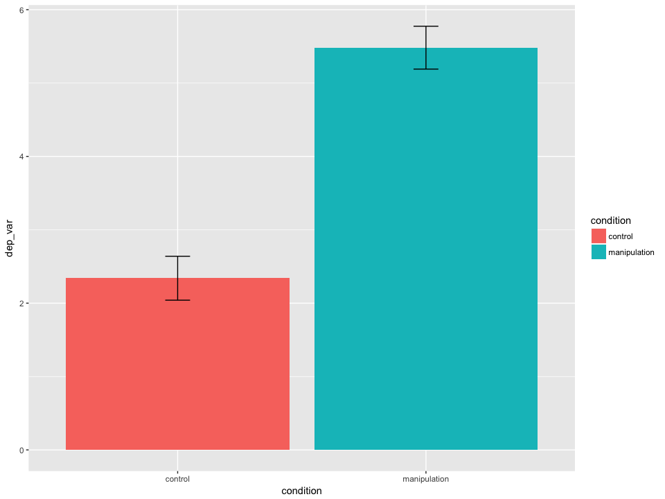

# learn R for psychology research: a crash course
Nicholas Michalak  
October 23, 2017  

# introduction
> I wrote this for psychologists who want to learn how to use R in their research **right now.** What does a psychologist need to know to use R to import, wrangle, plot, and model their data today? Here we go.

# foundations: people and their resources that inspired me.
> * [Dan Robinson (July 05, 2017)](http://varianceexplained.org/r/teach-tidyverse/) convinced me that beginneRs should learn tidyverse first, not Base R. This tutorial uses tidyverse. All you need to know about the differnece is in his blog post. If you've learned some R before this, you might understand that difference as you go through this tutorial.
> * If you want a more detailed introduction to R, start with [R for Data Science (Wickham & Grolemund, 2017)](http://r4ds.had.co.nz/). The chapters are short, easy to read, and filled with simple coding examples that demonstrate big principles. And **it's free.**
> * Hadley Wickham is a legend in the R community. He's responsible for the tidyverse, including ggplot2. Read his books and papers (e.g., [Wickham, 2014](http://vita.had.co.nz/papers/tidy-data.html)). Watch his talks (e.g., [ReadCollegePDX, October 19, 2015](https://youtu.be/K-ss_ag2k9E?list=PLNtpLD4WiWbw9Cgcg6IU75u-44TrrN3A4)). He's profoundly changed how people think about structuring and visualizing data.

# need-to-know basics

## Install R and R Studio (you need both in that order)
> * Installing R ( [Macintosh](https://stats.idre.ucla.edu/r/icu/installing-r-for-macintosh/) / [Windows](https://stats.idre.ucla.edu/r/icu/installing-r-for-windows/))
> * Uninstalling R ( [Macintosh](https://cran.r-project.org/doc/manuals/r-release/R-admin.html#Uninstalling-under-macOS) / [Windows](https://cran.r-project.org/doc/manuals/r-release/R-admin.html#Uninstallation))
> * [Installing R Studio](https://www.rstudio.com/products/rstudio/download/)
> * [Uninstalling R Studio](https://support.rstudio.com/hc/en-us/articles/200554736-How-To-Uninstall-RStudio-Desktop)

## understand all the panels in R Studio


## packages: they're like apps you download for R
> "Packages are collections of R functions, data, and compiled code in a well-defined format. The directory where packages are stored is called the library. R comes with a standard set of packages. Others are available for download and installation. Once installed, they have to be loaded into the session to be used." **Source:** https://www.statmethods.net/interface/packages.html


```r
# before you can load these libraries, you need to install them first (remove the # part first):
# install.packages("tidyverse")
# install.packages("haven")
# install.packages("psych")
# install.packages("car")

library(tidyverse)
library(haven)
library(psych)
library(car)
```

## objects: they save stuff for you
> "`object <- fuction(x)`, which means 'object is created from function(x)'. An object is anything created in R. It could be a variable, a collection of variables, a statistical model, etc. Objects can be single values (such as the mean of a set of scores) or collections of information; for example, when you run an analysis, you create an object that contains the output of that analysis, which means that this object contains many different values and variables. Functions are the things that you do in R to create your objects." **Source:** Field, A., Miles., J., & Field, Z. (2012). Discovering statistics using R. London: SAGE Publications.

## `c()` function: combine things like thing1, thing2, thing3, ...
> "c" stands for combine. Use this to combine values into a vector. "A vector is a sequence of data 'elements' of the same basic type." **Source:** http://www.r-tutor.com/r-introduction/vector
> Below, we create an object called five_numbers. We are naming it for what it is, but we could name it whatever we want: some_numbers, maple_tree, platypus. It doesn't matter. We'll use this in the examples in later chunks of code.


```r
# read: combine 1, 2, 3, 4, 5 and "save to", <-, five_numbers
five_numbers <- c(1, 2, 3, 4, 5)

# print five_numbers by just excecuting/running the name of the object
five_numbers
```

```
## [1] 1 2 3 4 5
```

## R Help: `help()` and `?`
> "The help() function and ? help operator in R provide access to the documentation pages for R functions, data sets, and other objects, both for packages in the standard R distribution and for contributed packages. To access documentation for the standard lm (linear model) function, for example, enter the command help(lm) or help("lm"), or ?lm or ?"lm" (i.e., the quotes are optional)." **Source:** https://www.r-project.org/help.html

## piping, `%>%`: write code kinda like you write sentences
> The `%>%` operator allows you to "pipe" a value forward into an expression or function; something along the lines of x `%>%` f, rather than f(x). See http://magrittr.tidyverse.org/articles/magrittr.html for more details, but check out these examples below.

## compute z-scores for those five numbers, called five_numbers
> * see help(scale) for details


```r
five_numbers %>% scale()
```

```
##            [,1]
## [1,] -1.2649111
## [2,] -0.6324555
## [3,]  0.0000000
## [4,]  0.6324555
## [5,]  1.2649111
## attr(,"scaled:center")
## [1] 3
## attr(,"scaled:scale")
## [1] 1.581139
```

## compute z-scores for five_numbers and then convert the result into only numbers
> * see help(parse_number) for details


```r
five_numbers %>% scale() %>% parse_number()
```

```
## [1] -1.2649111 -0.6324555  0.0000000  0.6324555  1.2649111
```

## compute z-scores for five_numbers and then convert the result into only numbers and then compute the mean
> * see help(mean) for details


```r
five_numbers %>% scale() %>% parse_number() %>% mean()
```

```
## [1] 0
```

## tangent: most R introductions will teach you to code the example above like this:


```r
mean(parse_number(scale(five_numbers)))
```

```
## [1] 0
```

> * I think this code is counterintuitive. You're reading the current sentence from left to right. That's how I think code should read like: how you read sentences. Forget this "read from the inside out" way of coding for now. You can learn the "read R code inside out" way when you have time and feel motivated to learn harder things. I'm assuming you don't right now.

## functions: they do things for you
> "A function is a piece of code written to carry out a specified task; it can or can not accept arguments or parameters and it can or can not return one or more values." Functions **do** things for you. **Source:** https://www.datacamp.com/community/tutorials/functions-in-r-a-tutorial#what

## compute the num of five_numbers
> * see help(sum) for details


```r
five_numbers %>% sum()
```

```
## [1] 15
```

## compute the length of five_numbers
> * see help(length) for details


```r
five_numbers %>% length()
```

```
## [1] 5
```

## compute the sum of five_numbers and divide by the length of five_numbers
> * see help(Arithmetic) for details


```r
five_numbers %>% sum() / five_numbers %>% length()
```

```
## [1] 3
```

## define a new function called compute_mean


```r
compute_mean <- function(some_numbers) {
  some_numbers %>% sum() / some_numbers %>% length()
}
```

## compute the mean of five_numbers


```r
five_numbers %>% compute_mean()
```

```
## [1] 3
```

## tangent: functions make assumptions; know what they are

### what is the mean of 5 numbers and a unknown number, NA?
> * see help(NA) for details


```r
c(1, 2, 3, 4, 5, NA) %>% mean()
```

```
## [1] NA
```

> Is this what you expected? Turns out, this isn’t a quirky feature of R. R was designed by statisticians and mathematicians. `NA` represents a value that is unknown. Ask yourself, what is the sum of an unknown value and 17? If you don’t know the value, then you don’t know the value of adding it to 17 either. The `mean()` function gives `NA` for this reason: the mean of 5 values and an unknwon value is `NA`; it’s unknown; it’s not available; it's missing. When you use functions in your own research, think about what the functions “assume” or “know”; ask, "What do I want the function to do? What do I expect it to do? Can the function do what I want with the information I gave it?"

### tell the `mean()` function to remove missing values


```r
c(1, 2, 3, 4, 5, NA) %>% mean(na.rm = TRUE)
```

```
## [1] 3
```

# create data for psychology-like examples
> This is the hardest section of the tutorial. Keep this is mind: we're making variables that you might see in a simple psychology dataset, and then we're going to combine them into a dataset. Don't worry about specifcs too much. If you want to understand how a function works, use ?name_of_function or help(name_of_function).

## subject numbers
> * read like this: generate a sequence of values from 1 to 100 by 1
> * see help(seq) for details


```r
subj_num <- seq(from = 1, to = 100, by = 1)

# print subj_num by just excecuting/running the name of the object
subj_num
```

```
##   [1]   1   2   3   4   5   6   7   8   9  10  11  12  13  14  15  16  17
##  [18]  18  19  20  21  22  23  24  25  26  27  28  29  30  31  32  33  34
##  [35]  35  36  37  38  39  40  41  42  43  44  45  46  47  48  49  50  51
##  [52]  52  53  54  55  56  57  58  59  60  61  62  63  64  65  66  67  68
##  [69]  69  70  71  72  73  74  75  76  77  78  79  80  81  82  83  84  85
##  [86]  86  87  88  89  90  91  92  93  94  95  96  97  98  99 100
```

> See those numbers on the left hand side of the output above? Those help you keep track of a sequence (i.e., line) of elements as the output moves to each new line. This is obvious in the example above because numbers correspond exactly to their position. But if these were letters or random numbers, that index or position (e.g., [14] "N") tells you the position of that element in the line.

## condition assignments
> * read like this: replicate each element of c("control", "manipulation") 50 times, and then turn the result into a factor
> * side: in R, factors are nominal variables (i.e., integers) with value labels (i.e., names for each integer).
> * see help(rep) and help(factor) for details


```r
condition <- c("control", "manipulation") %>% rep(each = 50) %>% factor()

# print condition by just excecuting/running the name of the object
condition
```

```
##   [1] control      control      control      control      control     
##   [6] control      control      control      control      control     
##  [11] control      control      control      control      control     
##  [16] control      control      control      control      control     
##  [21] control      control      control      control      control     
##  [26] control      control      control      control      control     
##  [31] control      control      control      control      control     
##  [36] control      control      control      control      control     
##  [41] control      control      control      control      control     
##  [46] control      control      control      control      control     
##  [51] manipulation manipulation manipulation manipulation manipulation
##  [56] manipulation manipulation manipulation manipulation manipulation
##  [61] manipulation manipulation manipulation manipulation manipulation
##  [66] manipulation manipulation manipulation manipulation manipulation
##  [71] manipulation manipulation manipulation manipulation manipulation
##  [76] manipulation manipulation manipulation manipulation manipulation
##  [81] manipulation manipulation manipulation manipulation manipulation
##  [86] manipulation manipulation manipulation manipulation manipulation
##  [91] manipulation manipulation manipulation manipulation manipulation
##  [96] manipulation manipulation manipulation manipulation manipulation
## Levels: control manipulation
```

## dependent measure

### save 5 values that represent the sample sizes and the true means and standard deviations of our pretend conditions


```r
sample_size <- 50
control_mean <- 2.5
control_sd <- 1
manip_mean <- 5.5
manip_sd <- 1
```

### introduce a neat function in R: `rnorm()`
> rnorm stands for random normal. Tell it sample size, true mean, and the true sd, and it'll draw from that normal population at random and spit out numbers.
> * see help(rnorm) for details


```r
# for example
rnorm(n = 10, mean = 0, sd = 1)
```

```
##  [1]  1.1257154  1.1964024 -0.6613703 -0.0735558 -0.0348884 -0.3560037
##  [7]  1.5376427  0.1132511 -1.5386344 -0.3774523
```

### randomly sample from our populations we made up above


```r
control_values <- rnorm(n = sample_size, mean = control_mean, sd = control_sd)

manipulation_values <- rnorm(n = sample_size, mean = manip_mean, sd = manip_sd)
```

### combine those and save as our dependent variable


```r
dep_var <- c(control_values, manipulation_values)

# print dep_var by just excecuting/running the name of the object
dep_var
```

```
##   [1] 3.4536884 2.5529560 2.2369948 1.4343264 1.8850497 3.1907278 2.5967756
##   [8] 1.4520309 4.8112093 2.9834465 2.3626087 2.0701750 2.1106188 2.3561900
##  [15] 3.2573769 3.7107890 4.7878241 2.4425718 2.8256646 0.5042158 1.6681864
##  [22] 1.6730768 2.9913271 1.0760922 1.4293423 2.1724917 1.5575957 0.5411216
##  [29] 0.6610585 2.7899028 1.9112434 4.0131559 2.4479327 2.7793602 0.2639412
##  [36] 0.9544170 1.8551323 3.4494977 1.3111139 3.4328386 3.6620918 3.0849587
##  [43] 2.0359454 3.0033953 2.9121453 3.5897782 2.3192074 1.9072540 1.6627552
##  [50] 0.8164154 5.7681167 4.8800742 4.8105439 5.1613568 5.6401706 6.1342269
##  [57] 6.4960296 5.5183209 7.3207193 6.9223905 4.7194008 5.4974910 7.1556225
##  [64] 4.2329621 4.4555581 4.6438218 3.6614002 4.2602928 5.6566578 6.6039267
##  [71] 4.9054336 4.3627425 6.8430500 4.1881496 4.6897280 5.8800814 5.6252425
##  [78] 5.2240409 4.1839919 3.0839934 5.8171747 6.4946019 5.1991809 6.2372809
##  [85] 6.1328432 6.9470594 7.0831013 6.2609995 5.4192742 5.6745287 5.4673264
##  [92] 5.3040585 2.9150219 5.6469535 5.6129642 5.5600961 6.9212130 4.9813536
##  [99] 6.4652407 5.4373196
```

## create a potentially confounding variable or a control variable
> in the code below, we multiply every value in dep_var by 0.5 and then we "add noise": 100 random normal values whose true population has a mean = 0 and sd = 1. Every value in dep_var * 0.5 gets a random value added to it.


```r
confound <- dep_var * 0.5 + rnorm(n = 100, mean = 0, sd = 1)

# print confound by just excecuting/running the name of the object
confound
```

```
##   [1]  1.18947328  0.38481878  0.86382454  0.45115625  1.99986156
##   [6]  1.83598666  1.15261057  0.92268706  3.11437905  1.04840878
##  [11]  1.05164821  0.73258325  0.94529087  1.34840686  3.84936887
##  [16]  3.53407376  2.92542560  0.36631153  2.39177730 -0.05581183
##  [21] -0.03405236 -0.37056295  1.33805400  1.70334944 -0.64893828
##  [26]  0.69860470  1.05302197  0.79188855  1.13172814  0.28510658
##  [31]  0.38326270  2.04637646  1.25476288  0.68111106  1.41096807
##  [36] -1.06105556 -0.03519084  0.22109986  1.66371579  1.29628310
##  [41]  2.44629309  0.83093937  2.92174732  1.63119542  1.87272818
##  [46] -0.07430811 -2.31605204  0.07631759  2.53180947  0.92018529
##  [51]  2.39368985  0.67366691  2.10939096  1.83149740  2.52692704
##  [56]  2.92155144  3.93906683  2.39371815  3.43173099  4.53215688
##  [61]  2.69659433  3.98625224  4.20955763  0.93366111  3.40775101
##  [66]  2.85955284  1.44798076  2.88865303  3.61743903  4.06722688
##  [71]  1.21685562 -0.01713554  3.81051231  2.03528591  1.75360059
##  [76]  2.54239777  4.29196824  2.75865815  2.28456807 -0.45979384
##  [81]  2.23947143  5.86686964  2.27257553  2.29204251  2.84572424
##  [86]  3.61642839  4.46997301  2.17081885  0.35886069  2.87573016
##  [91]  3.94757068  1.46576078  1.31039868  2.84749970  3.85892826
##  [96]  2.89473609  3.41740039  2.30975118  1.81112701  1.07309511
```

## subject gender
> * read like this: replicate each element of c("Woman", "Man") sample_size = 50 times, and then turn the result into a factor


```r
gender <- c("Woman", "Man") %>% rep(times = sample_size) %>% factor()

# print gender by just excecuting/running the name of the object
gender
```

```
##   [1] Woman Man   Woman Man   Woman Man   Woman Man   Woman Man   Woman
##  [12] Man   Woman Man   Woman Man   Woman Man   Woman Man   Woman Man  
##  [23] Woman Man   Woman Man   Woman Man   Woman Man   Woman Man   Woman
##  [34] Man   Woman Man   Woman Man   Woman Man   Woman Man   Woman Man  
##  [45] Woman Man   Woman Man   Woman Man   Woman Man   Woman Man   Woman
##  [56] Man   Woman Man   Woman Man   Woman Man   Woman Man   Woman Man  
##  [67] Woman Man   Woman Man   Woman Man   Woman Man   Woman Man   Woman
##  [78] Man   Woman Man   Woman Man   Woman Man   Woman Man   Woman Man  
##  [89] Woman Man   Woman Man   Woman Man   Woman Man   Woman Man   Woman
## [100] Man  
## Levels: Man Woman
```

## subject age
> * read like this: generate a sequence of values from 18 to 25 by 1, and take a random sample of 100 values from that sequence (with replacement)
> * see help(sample) for details


```r
age <- seq(from = 18, to = 25, by = 1) %>% sample(size = 100, replace = TRUE)

# print gender by just excecuting/running the name of the object
age
```

```
##   [1] 19 25 24 25 21 22 20 22 25 20 23 18 24 23 18 18 21 21 20 19 21 22 18
##  [24] 19 22 25 23 19 22 22 25 18 22 24 25 23 24 24 25 18 19 22 20 23 20 22
##  [47] 24 20 23 25 21 20 24 25 25 22 21 19 23 21 25 22 23 24 19 23 18 21 19
##  [70] 23 21 22 24 24 20 22 18 19 23 21 23 22 23 24 18 21 22 23 23 19 19 20
##  [93] 22 21 24 24 23 24 20 18
```

## `data.frame()` and `tibble()`
> "The concept of a data frame comes from the world of statistical software used in empirical research; it generally refers to "tabular" data: a data structure representing cases (rows), each of which consists of a number of observations or measurements (columns). Alternatively, each row may be treated as a single observation of multiple "variables". In any case, each row and each column has the same data type, but the row ("record") datatype may be heterogenous (a tuple of different types), while the column datatype must be homogenous. Data frames usually contain some metadata in addition to data; for example, column and row names." **Source:** https://github.com/mobileink/data.frame/wiki/What-is-a-Data-Frame%3F

> "**Tibbles** are a modern take on data frames. They keep the features that have stood the test of time, and drop the features that used to be convenient but are now frustrating (i.e. converting character vectors to factors)." **Source:** https://cran.r-project.org/web/packages/tibble/vignettes/tibble.html

## put all our variable we made into a tibble
> * every variable we made above is seperated by a comma -- these will become columns in our dataset
> * see help(data.frame) and help(tibble) for details


```r
example_data <- tibble(subj_num, condition, dep_var, confound, gender, age)

# print example_data by just excecuting/running the name of the object
example_data
```

```
## # A tibble: 100 x 6
##    subj_num condition  dep_var  confound gender   age
##       <dbl>    <fctr>    <dbl>     <dbl> <fctr> <dbl>
##  1        1   control 3.453688 1.1894733  Woman    19
##  2        2   control 2.552956 0.3848188    Man    25
##  3        3   control 2.236995 0.8638245  Woman    24
##  4        4   control 1.434326 0.4511562    Man    25
##  5        5   control 1.885050 1.9998616  Woman    21
##  6        6   control 3.190728 1.8359867    Man    22
##  7        7   control 2.596776 1.1526106  Woman    20
##  8        8   control 1.452031 0.9226871    Man    22
##  9        9   control 4.811209 3.1143791  Woman    25
## 10       10   control 2.983446 1.0484088    Man    20
## # ... with 90 more rows
```

# data wrangling examples

## create new variables in data.frame or tibble
> * `mutate()` adds new variables to your tibble.
> * we're adding new columns to our dataset, and we're saving this new dataset as the same name as our old one (i.e., like changing an Excel file and saving with the same name)
> * see help(mutate) for details


```r
example_data <- example_data %>%
  mutate(dep_var_z = dep_var %>% scale() %>% parse_number(),
         confound_z = confound %>% scale() %>% parse_number())

# print example_data by just excecuting/running the name of the object
example_data
```

```
## # A tibble: 100 x 8
##    subj_num condition  dep_var  confound gender   age  dep_var_z
##       <dbl>    <fctr>    <dbl>     <dbl> <fctr> <dbl>      <dbl>
##  1        1   control 3.453688 1.1894733  Woman    19 -0.2422390
##  2        2   control 2.552956 0.3848188    Man    25 -0.7193470
##  3        3   control 2.236995 0.8638245  Woman    24 -0.8867081
##  4        4   control 1.434326 0.4511562    Man    25 -1.3118727
##  5        5   control 1.885050 1.9998616  Woman    21 -1.0731296
##  6        6   control 3.190728 1.8359867    Man    22 -0.3815263
##  7        7   control 2.596776 1.1526106  Woman    20 -0.6961362
##  8        8   control 1.452031 0.9226871    Man    22 -1.3024948
##  9        9   control 4.811209 3.1143791  Woman    25  0.4768249
## 10       10   control 2.983446 1.0484088    Man    20 -0.4913209
## # ... with 90 more rows, and 1 more variables: confound_z <dbl>
```

## select specific columns
> * `select()` selects your tibble's variables by name and in the exact order you specify.
> * see help(select) for details


```r
example_data %>% 
  select(subj_num, condition, dep_var)
```

```
## # A tibble: 100 x 3
##    subj_num condition  dep_var
##       <dbl>    <fctr>    <dbl>
##  1        1   control 3.453688
##  2        2   control 2.552956
##  3        3   control 2.236995
##  4        4   control 1.434326
##  5        5   control 1.885050
##  6        6   control 3.190728
##  7        7   control 2.596776
##  8        8   control 1.452031
##  9        9   control 4.811209
## 10       10   control 2.983446
## # ... with 90 more rows
```

## filter specific rows
> * `filter()` returns rows that all meet some condition you give it.
> * Note, `==` means "exactly equal to". See ?Comparison.
> * see help(filter) for details


```r
example_data %>% 
  filter(condition == "control")
```

```
## # A tibble: 50 x 8
##    subj_num condition  dep_var  confound gender   age  dep_var_z
##       <dbl>    <fctr>    <dbl>     <dbl> <fctr> <dbl>      <dbl>
##  1        1   control 3.453688 1.1894733  Woman    19 -0.2422390
##  2        2   control 2.552956 0.3848188    Man    25 -0.7193470
##  3        3   control 2.236995 0.8638245  Woman    24 -0.8867081
##  4        4   control 1.434326 0.4511562    Man    25 -1.3118727
##  5        5   control 1.885050 1.9998616  Woman    21 -1.0731296
##  6        6   control 3.190728 1.8359867    Man    22 -0.3815263
##  7        7   control 2.596776 1.1526106  Woman    20 -0.6961362
##  8        8   control 1.452031 0.9226871    Man    22 -1.3024948
##  9        9   control 4.811209 3.1143791  Woman    25  0.4768249
## 10       10   control 2.983446 1.0484088    Man    20 -0.4913209
## # ... with 40 more rows, and 1 more variables: confound_z <dbl>
```

## make your own table of summary data
> * `summarize()` let's you apply functions to your data to reduce it to single values. Typically, you create new summary values based on groups (e.g., condition, gender, id); for this, use `group_by()` first.
> * see help(summarize) and help(group_by) for details


```r
example_data %>% 
  group_by(gender, condition) %>% 
  summarize(Mean = mean(confound),
            SD = sd(confound),
            n = length(confound))
```

```
## # A tibble: 4 x 5
## # Groups:   gender [?]
##   gender    condition      Mean       SD     n
##   <fctr>       <fctr>     <dbl>    <dbl> <int>
## 1    Man      control 0.8098061 0.917681    25
## 2    Man manipulation 2.4544033 1.401227    25
## 3  Woman      control 1.3783007 1.317784    25
## 4  Woman manipulation 2.7867865 1.113264    25
```


# plotting your data with ggplot2
> "ggplot2 is a plotting system for R, based on the grammar of graphics, which tries to take the good parts of base and lattice graphics and none of the bad parts. It takes care of many of the fiddly details that make plotting a hassle (like drawing legends) as well as providing a powerful model of graphics that makes it easy to produce complex multi-layered graphics." **Source:**: http://ggplot2.org/

## make ggplots in layers
> * Aesthetic mappings describe how variables in the data are mapped to visual properties (aesthetics) of geoms. **Source:** http://ggplot2.tidyverse.org/reference/aes.html
> * Below, we map condition on our plot's x-axis and dep_var on its y-axis
> * see help(ggplot) for details


```r
example_data %>%
  ggplot(mapping = aes(x = condition, y = dep_var))
```

<!-- -->

> * Think of this like a blank canvas that we're going to add pictures to or like a map of the ocean we're going to add land mass to

## boxplot
> * next, we add—yes, add, with a `+`—a geom, a geometric element: `geom_boxplot()`
> * see help(geom_boxplot) for details


```r
example_data %>%
  ggplot(mapping = aes(x = condition, y = dep_var)) +
  geom_boxplot()
```

<!-- -->

> * Here's emphasis: we started with a blank canvas, and we added a boxplot. All ggplots work this way: start with a base and add layers.

## QQ-plots
> * Below, we plot the sample quantiles of dep_var against the theoretical quantiles
> * Useful for exploring the distribution of a variable
> * see help(geom_qq) for details


```r
example_data %>%
  ggplot(mapping = aes(sample = dep_var)) +
  geom_qq()
```

<!-- -->

## means and 95% confidence intervals
> * add a new aesthetic, fill, which will fill the geoms with different colors, depending on the variable (e.g., levels of categorical variables are assigned their own fill color)
> * `stat_summary()` does what its name suggests: it applies statistical summaries to your raw data to make the geoms (bars and error bars in our case below)
> * the width argument sets the width of the error bars.
> * see help(stat_summary) for details


```r
example_data %>%
  ggplot(mapping = aes(x = condition, y = dep_var, fill = condition)) +
  stat_summary(geom = "bar", fun.data = mean_cl_normal) +
  stat_summary(geom = "errorbar", fun.data = mean_cl_normal, width = 0.1)
```

<!-- -->

## scatterplots
> * we add `geom_point()` and `geom_smooth()` below to add points to the scatterplot and fit a linear regression line with 95% confidence ribbons/bands around that line
> * see help(geom_point) and help(geom_smooth)for details


```r
example_data %>%
  ggplot(mapping = aes(x = confound, y = dep_var)) +
  geom_point() +
  geom_smooth(method = "lm", se = TRUE)
```

<!-- -->

# descriptive statistics
> * `describe()`, help(describe)
> * `describeBy()`, help(describeBy)

## for whole sample


```r
example_data %>% 
  select(dep_var, dep_var_z, confound, confound_z) %>% 
  describe()
```

```
##            vars   n mean   sd median trimmed  mad   min  max range  skew
## dep_var       1 100 3.91 1.89   3.86    3.92 2.42  0.26 7.32  7.06 -0.03
## dep_var_z     2 100 0.00 1.00  -0.03    0.00 1.28 -1.93 1.81  3.74 -0.03
## confound      3 100 1.86 1.43   1.82    1.85 1.52 -2.32 5.87  8.18  0.05
## confound_z    4 100 0.00 1.00  -0.03   -0.01 1.06 -2.92 2.80  5.72  0.05
##            kurtosis   se
## dep_var       -1.17 0.19
## dep_var_z     -1.17 0.10
## confound      -0.11 0.14
## confound_z    -0.11 0.10
```

## by condition
> The code below is a little confusing. First, we're piping our subsetted tibble with only our four variables—dep_var and confound and their z-scored versions—into the first argument for the `describeBy()` function. But we need to give data to the group argument, so then we just give it another subsetted tibble with only our grouping variable, condition.


```r
example_data %>% 
  select(dep_var, dep_var_z, confound, confound_z) %>% 
  describeBy(group = example_data %>% select(condition))
```

```
## 
##  Descriptive statistics by group 
## condition: control
##            vars  n  mean   sd median trimmed  mad   min  max range  skew
## dep_var       1 50  2.34 1.05   2.34    2.33 1.00  0.26 4.81  4.55  0.16
## dep_var_z     2 50 -0.83 0.56  -0.83   -0.84 0.53 -1.93 0.48  2.41  0.16
## confound      3 50  1.09 1.16   1.05    1.07 0.99 -2.32 3.85  6.17 -0.02
## confound_z    4 50 -0.53 0.81  -0.56   -0.55 0.69 -2.92 1.39  4.31 -0.02
##            kurtosis   se
## dep_var       -0.38 0.15
## dep_var_z     -0.38 0.08
## confound       0.60 0.16
## confound_z     0.60 0.11
## -------------------------------------------------------- 
## condition: manipulation
##            vars  n mean   sd median trimmed  mad   min  max range  skew
## dep_var       1 50 5.48 1.03   5.54    5.52 1.05  2.92 7.32  4.41 -0.32
## dep_var_z     2 50 0.83 0.54   0.86    0.85 0.56 -0.53 1.81  2.33 -0.32
## confound      3 50 2.62 1.26   2.62    2.65 1.20 -0.46 5.87  6.33 -0.12
## confound_z    4 50 0.53 0.88   0.53    0.56 0.84 -1.62 2.80  4.42 -0.12
##            kurtosis   se
## dep_var       -0.30 0.15
## dep_var_z     -0.30 0.08
## confound      -0.04 0.18
## confound_z    -0.04 0.12
```

# read in your own data
> * .csv file: `read_csv()`
> * .txt file: `read_delim()`
> * SPSS .sav file: `read_sav()`

## SPSS
> * see help(read_sav) for details


```r
# path to where file lives on your computer
coffee_filepath <- "coffee.sav"

coffee_data <- coffee_filepath %>% read_sav()

# print coffee_data by just excecuting/running the name of the object
coffee_data
```

```
## # A tibble: 138 x 3
##    image brand  freq
##    <dbl> <dbl> <dbl>
##  1     1     1    82
##  2     2     1    96
##  3     3     1    72
##  4     4     1   101
##  5     5     1    66
##  6     6     1     6
##  7     7     1    47
##  8     8     1     1
##  9     9     1    16
## 10    10     1    60
## # ... with 128 more rows
```

## CSV
> * see help(read_csv) for details


```r
# path to where file lives on your computer
coffee_filepath <- "coffee.csv"

coffee_data <- coffee_filepath %>% read_csv()
```

```
## Parsed with column specification:
## cols(
##   image = col_integer(),
##   brand = col_integer(),
##   freq = col_integer()
## )
```

## TXT
> * see help(read_delim) for details


```r
# path to where file lives on your computer
coffee_filepath <- "coffee.txt"

coffee_data <- coffee_filepath %>% read_delim(delim = " ")
```

```
## Parsed with column specification:
## cols(
##   image = col_integer(),
##   brand = col_integer(),
##   freq = col_integer()
## )
```

# modeling your data

## `t.test()`, help(t.test)


```r
t.test(dep_var ~ condition, data = example_data)
```

```
## 
## 	Welch Two Sample t-test
## 
## data:  dep_var by condition
## t = -15.104, df = 97.938, p-value < 2.2e-16
## alternative hypothesis: true difference in means is not equal to 0
## 95 percent confidence interval:
##  -3.554944 -2.729260
## sample estimates:
##      mean in group control mean in group manipulation 
##                   2.339960                   5.482063
```

## `pairs.panels()`, help(pairs.panels)
> shows a scatter plot of matrices (SPLOM), with bivariate scatter plots below the diagonal, histograms on the diagonal, and the Pearson correlation above the diagonal (see ?pairs.panels).


```r
example_data %>% 
  select(dep_var, confound, age) %>% 
  pairs.panels()
```

<!-- -->

## `lm()`, help(lm)


```r
lm_fit <- lm(dep_var ~ condition + confound, data = example_data)

# print lm_fit by just excecuting/running the name of the object
lm_fit
```

```
## 
## Call:
## lm(formula = dep_var ~ condition + confound, data = example_data)
## 
## Coefficients:
##           (Intercept)  conditionmanipulation               confound  
##                1.8329                 2.4346                 0.4634
```

## `summary()`, help(summary)


```r
lm_fit %>% summary()
```

```
## 
## Call:
## lm(formula = dep_var ~ condition + confound, data = example_data)
## 
## Residuals:
##      Min       1Q   Median       3Q      Max 
## -2.22289 -0.52086  0.04063  0.54844  1.79128 
## 
## Coefficients:
##                       Estimate Std. Error t value Pr(>|t|)    
## (Intercept)            1.83293    0.14799  12.385  < 2e-16 ***
## conditionmanipulation  2.43464    0.20848  11.678  < 2e-16 ***
## confound               0.46344    0.07326   6.326 7.76e-09 ***
## ---
## Signif. codes:  0 '***' 0.001 '**' 0.01 '*' 0.05 '.' 0.1 ' ' 1
## 
## Residual standard error: 0.8797 on 97 degrees of freedom
## Multiple R-squared:  0.7873,	Adjusted R-squared:  0.7829 
## F-statistic: 179.5 on 2 and 97 DF,  p-value: < 2.2e-16
```

## `Anova()`, help(Anova)


```r
lm_fit %>% Anova(type = "III")
```

```
## Anova Table (Type III tests)
## 
## Response: dep_var
##              Sum Sq Df F value    Pr(>F)    
## (Intercept) 118.707  1 153.391 < 2.2e-16 ***
## condition   105.541  1 136.378 < 2.2e-16 ***
## confound     30.966  1  40.013 7.764e-09 ***
## Residuals    75.067 97                      
## ---
## Signif. codes:  0 '***' 0.001 '**' 0.01 '*' 0.05 '.' 0.1 ' ' 1
```

## recommended resources
> * ReadCollegePDX (2015, October 19). Hadley Wickham "Data Science with R". Retrieved from https://youtu.be/K-ss_ag2k9E?list=PLNtpLD4WiWbw9Cgcg6IU75u-44TrrN3A4
> * Robinson, D. (2017, July 05). Teach the tidyverse to beginners. Variance Explained. Retreived from http://varianceexplained.org/r/teach-tidyverse/
> * Wickham, H. (2014). [Tidy data](http://vita.had.co.nz/papers/tidy-data.html). Journal of Statistical Software, 59(10), 1-23.
> * [The tidyverse style guide](http://style.tidyverse.org/) by Hadley Wickham
> * Wickham, H., & Grolemund, G. (2017). [R for Data Science: Import, Tidy, Transform, Visualize, and Model Data](http://r4ds.had.co.nz/). Sebastopol, CA: O'Reilly Media, Inc.

## more advanced data wrangling and analysis techniques by psychologists, for psychologists
> * [R programming for research](https://github.com/nmmichalak/R_programming_for_research), a workshop instructed by Nick Michalak and Iris Wang at the University of Michigan

## more information about tidyverse and the psych package
> * [tidyverse: R packages for data science](https://www.tidyverse.org/)
> * [Using R and psych for personality and psychological research](http://personality-project.org/r/psych/)

## R Studio cheat sheets
> * [RStudio Cheat Sheets](https://www.rstudio.com/resources/cheatsheets/)


