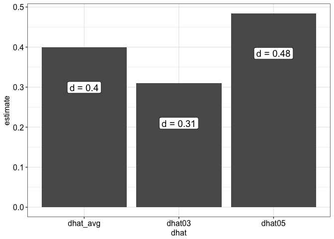
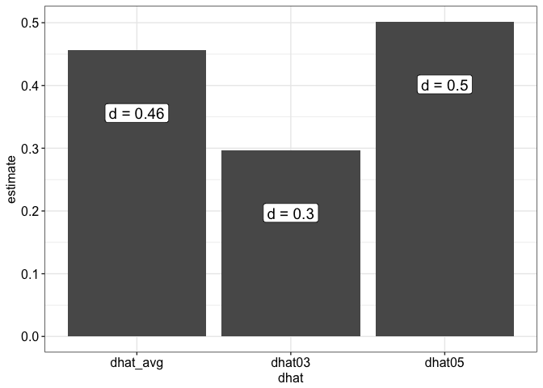
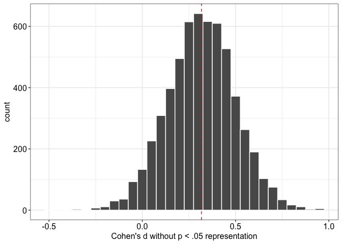

<style type = "text/css">

body{ /* Normal  */
      font-size: 18px;
  }
</style>

For readers who aren't familair with *p*-curve, it was developed by Simonsohn, Nelson, and Simons (2014, [.html](https://papers.ssrn.com/sol3/papers.cfm?abstract_id=2256237)) who define it as,

> "the distribution of statistically significant *p*-values from a set of independent findings (p. 535)."

In their paper, they demonstrated how researchers can test whether a set of only statistically significant effects (i.e., *p* < .05) reveal evidential value. They went on to develop a technique for estimating the average true effect from a given *p*-curve ([.html](https://papers.ssrn.com/sol3/papers.cfm?abstract_id=2377290)).

The tests and the effect size estimation technique for *p*-curve are quite popular (see [www.p-curve.com](www.p-curve.com)), at least popular enough to attract some pretty harsh criticisms. In this post, I focus on one:

> *p*-curve gives biased estimates when significant *p*-values stem from a heterogeneous distribution of true effect sizes. In other words, *p*-curve's estimates are too big when effect sizes vary around some true average effect.

Specifically, McShane, Böckenholt, and Hansen (2016) ([.html](http://www.blakemcshane.com/Papers/pps_selectionmethods.pdf)) argue that when nonsignificant (i.e., *p* > .05) results make up part of some research literature, and these effects vary in size (i.e., standard devation > 0), then *p*-curve estimates upwardly biased effect sizes (i.e., bigger than the average true effect). In their paper, they report simulation results which convincingly make their point (see the top row of Figure 3 in their paper).

 

They conclude, 

> "Given that studies with results that are not statistically significant are indeed published and that heterogeneity is the norm in behavioral research, we should indeed be circumspect about the application of one-parameter approaches such as the *p*-curve (p. 742)."

To be sure, Simonsohn, Nelson, and Simons (2014) aknowledge that *p*-curve ignores effect size information from nonsignificant results, which gives *p*-curve fewer reports to work with. *P*-curve will generally give more variable estimates from smaller samples of significant studies than from larger samples. However, Simonsohn et al. comes to a different conclusion about bias:

> "Note that although excluding nonsignificant results makes *p*-curve noisier (less efficient), it does not make *p*-curve biased (p. 675)."

In fact, between the main text and their supplement, they reported 4 simulations under which *p*-curve recovered accurate average effect sizes even when the true average effect size varied: see Figure 2, panel B in their effect size paper

 

and Figure S2 from their Supplement, [.html](http://p-curve.com/Supplement/Supplement_pcurve2.pdf)).   


   
  
At first glance, it seems like both research teams simulated practically the same conditions—similar true average effect sizes and standard deviations—but one team (McShane et al.) reported upwardly biased estimates and the other (Simonsohn et al.) reported accurate ones. Are the sumulation conditions actually different?

Yes. But even when I show you the difference, you might be surprised about how difficult it is determine whether or how much heterogeneity matters when you're interpreting *p*-curve results. But first, I need to show you a few examples.

I'll start with the intuitive example from  Simonsohn et al.'s Supplement 2. There, they present Figure S2 above, which displays the results of a simulation of two true effect sizes, *d~1~* and *d~2~*. *P*-curve's average of these two effects—the average true effect—depends on how each effect is weighted. If cell sizes and statistically significant effects are equal—that is, if we assume each study of each true effect used the same *n* per condition and reported the same number of significant effects—then *p*-curve will estimate the simple average true effect, (*d~1~* + *d~2~*) / 2. Simonsohn et al. don't provide the R code for this particular figure, but it's easy enough to figure it out from their code for their more complex simulations ([.html](http://www.p-curve.com/Supplement/Rcode_paper2/2-%20Fig%202%20-%20File-drawering%20and%20effect%20size%20estimation.R)). I walk through the steps below. Keep in mind I borrowed heavily from Simonsohn et al.'s code.

## load packages I'll use throughout


```r
library(tidyverse)
library(compute.es)
library(weightr)
```

## start by saving two different effect sizes, *d*


```r
d03 <- 0.30
d05 <- 0.50
```

## save two equal cell sizes, *n*


```r
n03 <- 20
n05 <- 20
```

## compute degrees of freedom, df, for independent samples *t*-tests


```r
df03 <- 2 * (n03 - 1)
df05 <- 2 * (n05 - 1)
```

## compute critical *t*-values, tcrit, for alpha = .05 (two-tailed)


```r
tcrit03 <- qt(1 - 0.05 / 2, df03)
tcrit05 <- qt(1 - 0.05 / 2, df05)
```
  
## noncentrality parameters, ncp
> noncentrality parameter is a fancy word for the distribution of a test statistic (e.g., *t*, *F*, *chi^2^*) when there is an effect. as you might guess, a centrality parameter represents the distribution when there is no effect.


```r
ncp03 <- sqrt(n03 / 2) * d03
ncp05 <- sqrt(n05 / 2) * d05
```

## calculate powers, pwr


```r
pwr03 = 1 - pt(q = tcrit03, df = df03, ncp = ncp03)
pwr05 = 1 - pt(q = tcrit05, df = df05, ncp = ncp05)
```

## draw 5000 "p"-values at random
> from Uri Simonsohn ([.html](http://www.p-curve.com/Supplement/Rcode_paper2/2-%20Fig%202%20-%20File-drawering%20and%20effect%20size%20estimation.R)): "generates the randomly draw "p"-values from a uniform (p-values but computed with the noncentral). Once we know power, we know that every t-value above the power_th percentile of them, under the ncp, will give a p < .05 if we evaluate it with the central t so we draw only from that range. Example. Say that for a given n=20 & d=5-->power =33%. To draw significant t-values under the null of d=.5, then, we compute the inverse of randomly drawn uniform values between .67 and 1 (the biggest third) form the `qt(rt(min=.67,max=1),ncp=sqrt(20/2)*.5, df=38)`.


```r
rp03 <- runif(n = 5000, min = 1 - pwr03, max = 1)
rp05 <- runif(n = 5000, min = 1 - pwr05, max = 1)
```
  
## observed *t*-statistics, *t*


```r
t03 <- qt(p = rp03, df = df03, ncp = ncp03)
t05 <- qt(p = rp05, df = df05, ncp = ncp05)
```

```
## Warning in qt(p = rp05, df = df05, ncp = ncp05): full precision may not
## have been achieved in 'pnt{final}'
```

## `loss()` function from Simonsohn, Nelson, and Simons (2014) ([.html](http://www.p-curve.com/Supplement/Rcode_paper2/9%20-%20Loss%20Function%20and%20Estimation.R))


```r
loss <- function(ti, dfi, dhat) {  
  # noncentrality parameter, ncpi
  ncpi <- sqrt((dfi + 2) / 4) * dhat
  
  # critical t-value, tcriti
  tcriti <- qt(1 - 0.05 / 2, dfi)
  
  # power for ncp given tcriti, pwri
  pwri <- 1 - pt(tcriti, dfi, ncpi)
  
  # overall probability of a t > ti, given ncp, plarger
  plarger <- pt(ti, df = dfi, ncp = ncpi)
  
  # right skew pp-value, ppr
  ppr <- (plarger - (1 - pwri)) / pwri
  
  # returns the D statistic outputted by the KS test against the uniform, KSD
  ks.test(ppr, punif)$statistic
  }
```

## use the `optimize()` function to estimate the average effect size, *d*
> note: interval gives a range of possible effect sizes to "look" for. we know the "true" effect size, so we can save computation time by setting a pretty narrow interval, ± *d* = 0.20


```r
# surpress warnings
options(warn = -1)

(dhat03 <- optimize(loss, interval = c(d03 - 0.20, d03 + 0.20), ti = t03, dfi = df03)$minimum)
```

```
## [1] 0.3027289
```

```r
(dhat05 <- optimize(loss, interval = c(d05 - 0.20, d05 + 0.20), ti = t05, dfi = df05)$minimum)
```

```
## [1] 0.5005069
```

## combine them and estimate the average effect size


```r
# surpress warnings
options(warn = -1)

(dhat_avg <- optimize(loss, interval = c(d03 - 0.20, d05 + 0.20), ti = c(t03, t05), dfi = c(df03, df05))$minimum)
```

```
## [1] 0.4085715
```

## plot all 3 estimates

### save custom plotting theme


```r
blog_theme <- theme_bw() +
  theme(legend.position = "top",
        axis.title.x = element_text(color = "Black", size = 12),
        axis.title.y = element_text(color = "Black", size = 12),
        axis.text.x = element_text(color = "Black", size = 12),
        axis.text.y = element_text(color = "Black", size = 12),
        legend.title = element_text(color = "Black", size = 12),
        legend.text = element_text(color = "Black", size = 12))
```

### ok, now plot


```r
tibble(dhat03, dhat05, dhat_avg) %>% 
  gather(key = dhat, value = estimate) %>% 
  ggplot(mapping = aes(x = dhat, y = estimate, label = paste0("d = ", round(estimate, 2)))) +
  geom_bar(stat = "identity") +
  geom_label(size = 5, nudge_y = -0.10) +
  blog_theme
```

<!-- -->

> the average effect size is just as they said—the simple average of the true effects, more or less

## what happens when we triple the cell sizes used to study one of the effects?


```r
n05 <- n05 * 3
```

## compute new df


```r
df05 <- 2 * (n05 - 1)
```

## compute a new critical *t*-value


```r
tcrit05 <- qt(1 - 0.05 / 2, df05)
```
  
## compute a new noncentrality parameter


```r
ncp05 <- sqrt(n05 / 2) * d05
```

## compute new power


```r
pwr05 = 1 - pt(q = tcrit05, df = df05, ncp = ncp05)
```

## draw another 5000 "p"-values at random
> for each—why not?


```r
rp03 <- runif(n = 5000, min = 1 - pwr03, max = 1)
rp05 <- runif(n = 5000, min = 1 - pwr05, max = 1)
```
  
## compute new observed *t*-statistics


```r
t03 <- qt(p = rp03, df = df03, ncp = ncp03)
t05 <- qt(p = rp05, df = df05, ncp = ncp05)
```

## estimate new effect sizes


```r
# surpress warnings
options(warn = -1)

(dhat03 <- optimize(loss, interval = c(d03 - 0.20, d03 + 0.20), ti = t03, dfi = df03)$minimum)
```

```
## [1] 0.2853848
```

```r
(dhat05 <- optimize(loss, interval = c(d05 - 0.20, d05 + 0.20), ti = t05, dfi = df05)$minimum)
```

```
## [1] 0.4996455
```

## combine them for the average effect size


```r
# surpress warnings
options(warn = -1)

(dhat_avg <- optimize(loss, interval = c(d03 - 0.20, d05 + 0.20), ti = c(t03, t05), dfi = c(df03, df05))$minimum)
```

```
## [1] 0.4514584
```

## plot all 3 estimates


```r
tibble(dhat03, dhat05, dhat_avg) %>% 
  gather(key = dhat, value = estimate) %>% 
  ggplot(mapping = aes(x = dhat, y = estimate, label = paste0("d = ", round(estimate, 2)))) +
  geom_bar(stat = "identity") +
  geom_label(size = 5, nudge_y = -0.10) +
  blog_theme
```

<!-- -->

> because the larger effect *d* = 0.50 had a larger cell size—thus more power and more *p* < .05—*p*-curve gave more weight to that effect when it estimated the average true effect

Next, I borrow (again) from Simonsohn et al.'s code to create a custom function for simulating a more complex data set. This allows me to simulate conditions closer to those reported in the main text in Simonsohn et al. and compare them to those reported in McShane et al.

## I define a new function, `sim_d()`
> * d_mean: Cohen's d mean
> * d_sd: Cohen's d standard deviation
> * n0: smallest cell size
> * n1: largest cell size

> note that d_sd is basically tau, the heterogeneity estimate you may have seen reported in meta-analyses


```r
sim_d <- function(d_mean, d_sd, n0, n1) {
  
  # 1 random sample, d ~ N(d_mean, d_sd)
  di <- rnorm(n = 1, mean = d_mean, sd = d_sd)
  
  # if smallest and largest cell size considered are exactly equal, use n0
  if(n0 == n1) {
    ni <- n0
    }
  
  # else, calculate n0 and n1, cell sizes for each power level
  else {
    ni <- sample(n0:n1, size = 1, replace = TRUE)
  }
  
  # calculate observed degree of freedom, dfi
  dfi <- 2 * (ni - 1)
  
  # calculate critical t-value, tcriti
  tcriti <- qt(1 - 0.05 / 2, dfi)
  
  # calculate noncentrality parameter, ncpi
  ncpi <- sqrt(ni / 2) * di
  
  # calculate power, pwri
  pwri = 1 - pt(q = tcriti, df = dfi, ncp = ncpi)
  
  # from simonsohn: "Once we know power, we know that every
  # t-value above the power_th percentile of them, under the ncp,
  # will give a p < .05 if we evaluate it with the central t so we
  # draw only from that range." (random p-values from the noncentral, rpi)
  rpi <- runif(n = 1, min = 1 - pwri, max = 1)
  
  # calculate observed t-statistic, ti
  ti <- qt(p = rpi, df = dfi, ncp = ncpi)
  
  # return list with these values
  list(ti = ti, dfi = dfi, di = di)
}
```

## with `sim_d()`, replicate 10000 studies
> like Figure 2, Panel C in Simonsohn et al., mean *d* = 0.40, *d* standard deviation *d* = 0.20, and cell sizes range from *n* = 10 to *n* = 70


```r
sim_data <- replicate(n = 10000, sim_d(d_mean = 0.40, d_sd = 0.20, n0 = 10, n1 = 70), simplify = FALSE)
```

## extract observed *t*-statistics, *t*i


```r
ti <- sapply(sim_data, function(x) x[["ti"]])
```

## extract observed degrees of freedom, dfi


```r
dfi <- sapply(sim_data, function(x) x[["dfi"]])
```

## extract true Cohen's *d* values, *d*i


```r
di <- sapply(sim_data, function(x) x[["di"]])
```

## estimate true Cohen's *d* mean and sd
> this insures that our simulation generated the conditions I requested


```r
# mean
mean(di)
```

```
## [1] 0.4024289
```

```r
# standard deviation
sd(di)
```

```
## [1] 0.2005379
```

## estimate the  effect size


```r
# surpress warnings
options(warn = -1)

(dhat <- optimize(loss, interval = c(0, 0.80), ti = ti, dfi = dfi)$minimum)
```

```
## [1] 0.4277641
```

> the bias estimate is 4 - 0.43 = -0.03. Not too bad.

Next, here's a rough version of what McShane, Böckenholt, and Hansen (2016) ([.html](http://www.blakemcshane.com/Papers/pps_selectionmethods.pdf)) did. This example is conceptually similar to the example in Simonsohn et al. Supplement 2 in which cell size was held constant but, instead of sampling equal numbers of significant effects from each distribution, they merely saved significant effects from a set number of "attempted" studies of those distributions. In the long run of a simulation, this means larger true effects receive more weight in *p*-curve's estimates. In other words, bigger effects find more *p* < .05, which gives them more weight, which produces upwardly baised estimates. This is exactly what McShane et al. predicted and found. I demonstrate this below.

## sample 10000 Cohen's *d* from a normal distribution
> mean = 0.40 and sd = 0.20


```r
di <- rnorm(n = 10000, mean = 0.40, sd = 0.20)
```

## sample cell sizes between *n* = 10 and *n* = 70


```r
ni <- sample(10:70, size = 10000, replace = TRUE)
```

## compute degrees of freedom


```r
dfi <- 2 * (ni - 1)
```

## compute noncentrality parameters


```r
ncpi <- sqrt(ni / 2) * di
```

## compute t-statistics


```r
ti <- sapply(1:length(di), function(i) {
  rt(n = 1, df = dfi[i], ncp = ncpi[i])
})
```

## estimate true Cohen's *d* mean and sd


```r
mean(di)
```

```
## [1] 0.4034203
```

```r
sd(di)
```

```
## [1] 0.1992211
```

# compute *p*-values
> this is necessary when they're not all *p* < .05. also, note that I compute one-tailed *p*-values in order to take the predicted positive direction into account


```r
pi <- 1 - pt(q = ti, df = dfi)
```

## find effect size
> note I only use effects that result in *p* < .025, which gives us significant effects in the predicted direction (i.e., positive and *p* < .05, two-tailed)


```r
# surpress warnings
options(warn = -1)

(dhat <- optimize(loss, interval = c(-1, 1), ti = ti[pi < 0.025], dfi = dfi[pi < 0.025])$minimum)
```

```
## [1] 0.5323708
```

> the bias estimate is 4 - 0.53 = -0.13. This bias should look familiar: compare this to the average bias estimate for *p*-curve Figure 3 in McShane et al. I used mean *d* = 0.40, which gives a bias estimate practically in the middle of those for mean *d* = 0.30 (~ 0.15) and mean *d* = 0.50 (~ 0.075) in their figure.

Bias here is caused by heterogeneity. Like I described above, not all true effects were given equal weight in *p*-curve's estimate. Larger effects with larger cell sizes (i.e., higher powered studies) were given more weight, so *p*-curve gave a larger estimate than the average true effect.

I'll illustrate what I think is the key difference between the Simonsohn et al. and McShane et al. simulation environments. Below I plot a histogram of the *true* effect sizes whose studies did not find *p* < .05.


```r
tibble(d_nosig = di[pi > 0.025]) %>% 
  ggplot(mapping = aes(x = d_nosig)) +
  geom_histogram(color = "white") +
  geom_vline(xintercept = mean(di[pi > 0.025]), color = "red", linetype = "dashed") +
  scale_x_continuous(breaks = pretty(di[pi > 0.025])) +
  labs(x = "Cohen's d without p < .05 representation") +
  blog_theme
```

```
## `stat_bin()` using `bins = 30`. Pick better value with `binwidth`.
```

<!-- -->

What are these? In simulation land, these are just subset of random variables drawn from a hypothetical distribution. But in the "real world", these represent idiosyncratic study designs and any factors that might influence their results. These represent a relatively small galaxy of effect sizes that are waiting for their *p* < .05 if only luck (or statistical power) will have it.

McShane et al. and even Simonsohn et al. point this out as a major limitation of *p*-curve. McShane et al. go further and recommend that you use the information in those nonsignificant effects. For example, you could use `weightfunct()` from the weightr package ([.html](https://cran.r-project.org/web/packages/weightr/index.html)) to estimate the Iyengar and Greenhouse (1984) model. See below.

## estimate Cohen's *d* and its variance


```r
# effect size data
es_data <- tes(t = ti, n.1 = ni, n.2 = ni, dig = Inf, verbose = FALSE)

# extract Cohen's d, yi
yi <- es_data$d

# extract Cohen's d variance, vi
vi <- es_data$var.d
```

## fit Iyengar and Greenhouse (1984) model
> by the way, the line for .025 < *p* < 1 gives the estimate for how likely it is that *p* > .025 and < 1 are to be published, relative to *p* < .025 which get weight = 1. I only gave it effect that reached *p* < .025, so that estimate is 0.01 (i.e., 0.01 times as likely as *p* < .025 to be published)


```r
weightfunct(effect = yi, v = vi, steps = c(0.025, 1), table = TRUE, pval = pi)
```

```
## 
## Unadjusted Model (k = 10000):
## 
## tau^2 (estimated amount of total heterogeneity): 0.0409 (SE = 0.0013)
## tau (square root of estimated tau^2 value):  0.2022
## 
## Model Results:
## 
##           estimate std.error z-stat      p-val  ci.lb  ci.ub
## Intercept   0.4012  0.003125  128.4 < 2.22e-16 0.3951 0.4074
## 
## Adjusted Model (k = 10000):
## 
## tau^2 (estimated amount of total heterogeneity): 0.0407 (SE = 0.0013)
## tau (square root of estimated tau^2 value):  0.2018
## 
## Model Results:
## 
##               estimate std.error z-stat      p-val  ci.lb  ci.ub
## Intercept       0.3969  0.004987  79.59 < 2.22e-16 0.3871 0.4067
## 0.025 < p < 1   0.9632  0.032314  29.81 < 2.22e-16 0.8999 1.0265
## 
## Likelihood Ratio Test:
## X^2(df = 1) = 1.248599, p-val = 0.26382
## 
## Number of Effect Sizes per Interval:
## 
##                      Frequency
## p-values <0.025           4234
## 0.025 < p-values < 1      5766
```

> compare the Intercept estimate and tau estimate to the *d* mean and *d* sd I requested: this model gets it spot on.

But wait. Now compare its performance when only *p* < .05 effects are published


```r
weightfunct(effect = yi[pi < 0.025], v = vi[pi < 0.025], steps = c(0.025, 1), table = TRUE, pval = pi[pi < 0.025])
```

```
## 
## Unadjusted Model (k = 4234):
## 
## tau^2 (estimated amount of total heterogeneity): 0.0000 (SE = 0.0012)
## tau (square root of estimated tau^2 value):  0.0000
## 
## Model Results:
## 
##           estimate std.error z-stat      p-val  ci.lb ci.ub
## Intercept   0.6423  0.003395  189.2 < 2.22e-16 0.6357 0.649
## 
## Adjusted Model (k = 4234):
## 
## tau^2 (estimated amount of total heterogeneity): 0.0210 (SE = 0.0017)
## tau (square root of estimated tau^2 value):  0.1449
## 
## Model Results:
## 
##               estimate std.error z-stat      p-val  ci.lb  ci.ub
## Intercept        0.478  0.003541    135 < 2.22e-16 0.4711 0.4849
## 0.025 < p < 1    0.010       NaN    NaN         NA    NaN    NaN
## 
## Likelihood Ratio Test:
## X^2(df = 1) = 2876.266, p-val = < 2.22e-16
## 
## Number of Effect Sizes per Interval:
## 
##                      Frequency
## p-values <0.025           4234
## 0.025 < p-values < 1         0
```

> upwardly biased, as the methodologists say, but not as upward as *p*-curve's estimate

My point is that McShane et al. are right to recommend people use valuable information from effect sizes, *p* < .05 or not. What's more, this model does just as well as *p*-curve when only p < .05 are published—in my example but also in McShane et al.'s simulations.

But take a step back and think back to those *p* < .05-less studies represented in that histogram above. Those represent more combinations of manipulations, measures, sample characteristics, and contexts than those reported by any research literature that exists. Realistically, researchers will selectively (i.e., non-randomly) study a handful of these combinations, and those combinations that mostly easily produce interesting, statistically significant results will end up in meta-analyst's hands. Like Uri Simonsohn points out, *"The" effect size does not exist* ([.html](http://datacolada.org/33)). The effect sizes that received more weight in these simulations did so because they were larger. In simulation land, this is correctly called bias. But, perhaps, in the "real world", the studies that receive the most weight might represent the most interesting studies—to researchers, to funders, to everyday people. In other words, they represent not the true average, whatever that is, but, maybe, the *interesting* average.

Interesting in this case is just another name for heterogeneity-caused bias that we want.

## Some notes
> *Why p-curve excludes ps>.05* ([.html](http://datacolada.org/61)) and *PET-PEESE Is Not Like Homeopathy* ([.html](http://datacolada.org/59)) motivated this post—those and my own meta-analysis project with Neil Lewis, Jr. :-)


