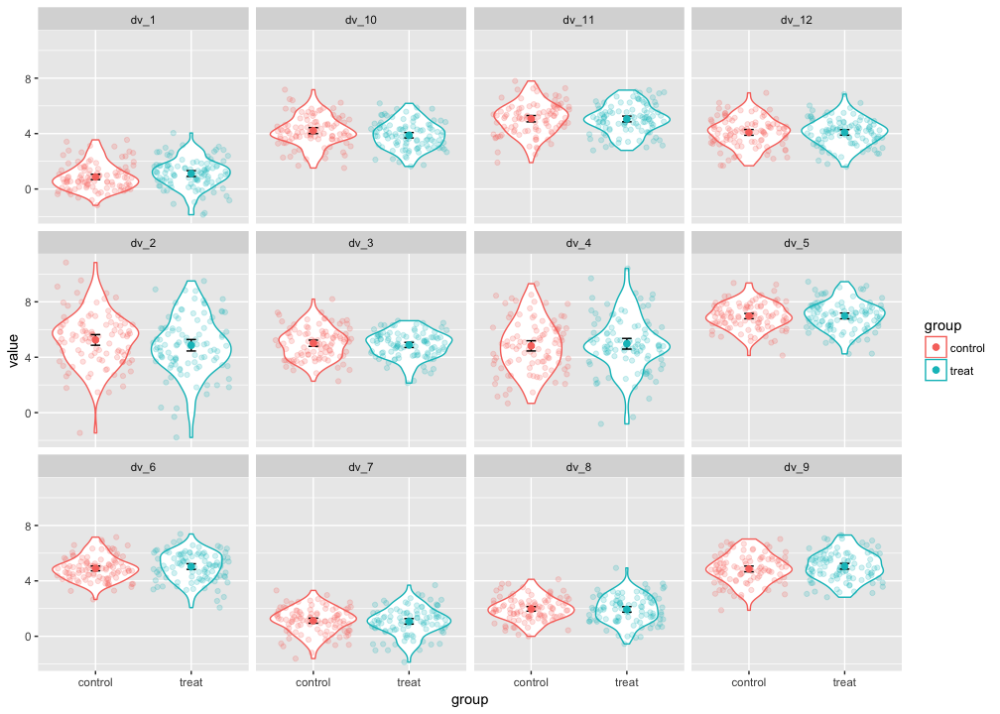

# Plot Ideas
Nicholas Michalak  
6/26/2017  

# install prerequisite packages


```r
# character vector of packages you'll need for your whole analysis
needed_packages <- c("tidyverse")

# source custom function
source("install_needed_pkgs.R")

# install needed packages
install_needed_pkgs(needed_packages = needed_packages)
```

```
## Loading tidyverse: ggplot2
## Loading tidyverse: tibble
## Loading tidyverse: tidyr
## Loading tidyverse: readr
## Loading tidyverse: purrr
## Loading tidyverse: dplyr
```

```
## Conflicts with tidy packages ----------------------------------------------
```

```
## filter(): dplyr, stats
## lag():    dplyr, stats
```

```
## [[1]]
##  [1] "dplyr"     "purrr"     "readr"     "tidyr"     "tibble"   
##  [6] "ggplot2"   "tidyverse" "stats"     "graphics"  "grDevices"
## [11] "utils"     "datasets"  "methods"   "base"
```

# tibble with two conditions and 12 DVs


```r
# set randomizer seed so results can be reproduced
set.seed(1234)

# tibble with two conditions and 12 DVs
dat <- tibble(group = factor(rep(c("control", "treat"), each = 100)))
dat[, paste0("dv_", 1:12)] <- list(m = sample(1:7, size = 12, replace = TRUE),
                                   s = sample(1:2, size = 12, replace = TRUE)) %>%
  pmap(function(m, s) rnorm(n = 200, mean = m, sd = s))
```

# plot


```r
# plot idea
dat %>%
  gather(dv, value, -group) %>%
  ggplot(mapping = aes(x = group, y = value, color = group)) +
  geom_violin() +
  geom_jitter(alpha = 0.2) +
  stat_summary(fun.data = "mean_cl_normal", geom = "errorbar", color = "black", width = 0.1) +
  stat_summary(fun.data = "mean_cl_normal", geom = "point", size = 2) +
  facet_wrap(~ dv)
```

<!-- -->

