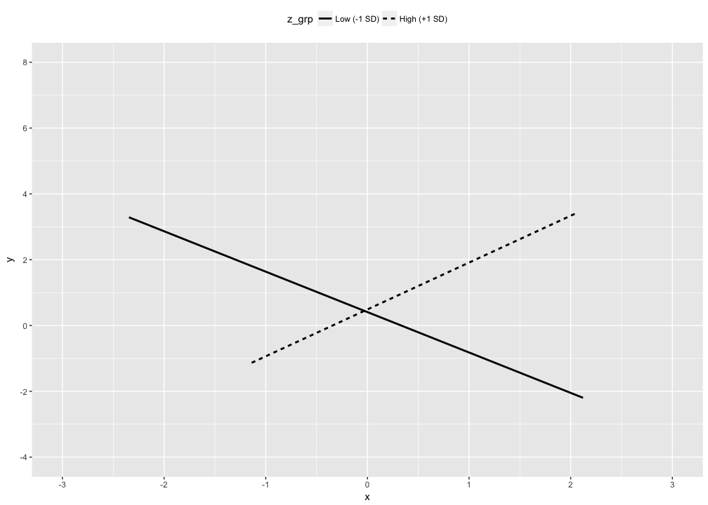
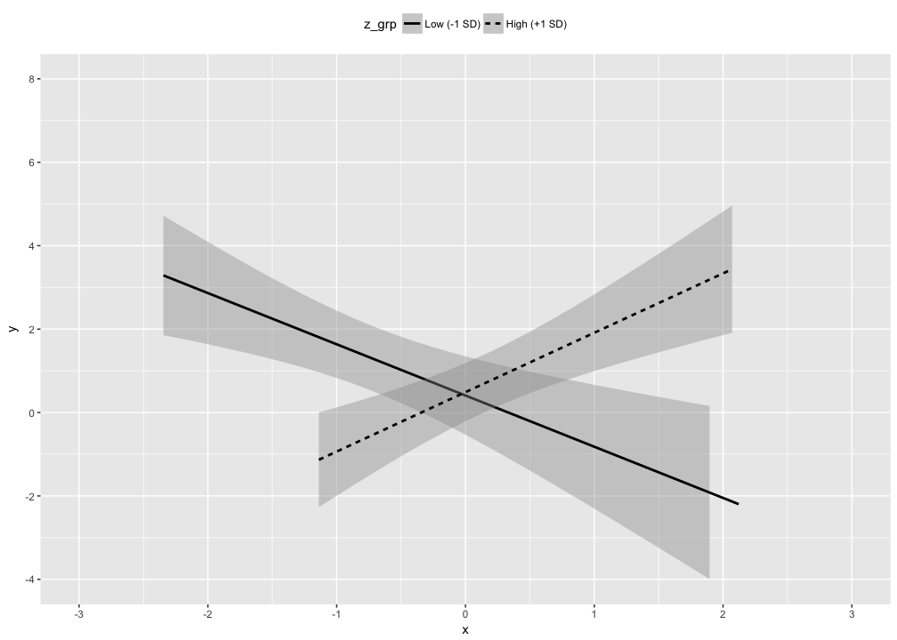
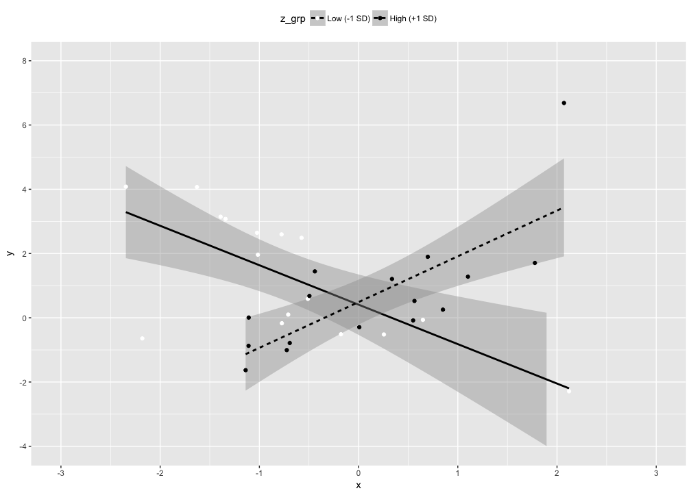

# Moderaion plots
Nicholas Michalak  
6/17/2017  

# packages


```r
# packages I"ll want in this analysis
want_packages <- c("tidyverse")

# which of those packages do I already have? (logical vector)
have_packages <- want_packages %in% rownames(installed.packages())

# if I don"t have any of those, install them
if(any(have_packages == FALSE)) install.packages(want_packages[have_packages == FALSE])

# load wanted packages
lapply(want_packages, library, character.only = TRUE)
```

```
## Loading tidyverse: ggplot2
## Loading tidyverse: tibble
## Loading tidyverse: tidyr
## Loading tidyverse: readr
## Loading tidyverse: purrr
## Loading tidyverse: dplyr
```

```
## Conflicts with tidy packages ----------------------------------------------
```

```
## filter(): dplyr, stats
## lag():    dplyr, stats
```

```
## [[1]]
##  [1] "dplyr"     "purrr"     "readr"     "tidyr"     "tibble"   
##  [6] "ggplot2"   "tidyverse" "stats"     "graphics"  "grDevices"
## [11] "utils"     "datasets"  "methods"   "base"
```

# data


```r
# set randomizer seed
set.seed(1234)

# random normal data
# two-way interaction
x <- rnorm(n = 100, mean = 0, sd = )
z <- x * 0.4 + rnorm(n = 100, mean = 0, sd = 1)
y <- x * z + rnorm(n = 100, mean = 0, sd = 1)

# store in a dataframe
examp_dat <- data.frame(y, x, z)
```

# models


```r
# without interaction term
model_1 <- lm(y ~ x + z)
summary(model_1)
```

```
## 
## Call:
## lm(formula = y ~ x + z)
## 
## Residuals:
##     Min      1Q  Median      3Q     Max 
## -3.3052 -0.8771 -0.1415  0.5552  6.2626 
## 
## Coefficients:
##             Estimate Std. Error t value Pr(>|t|)    
## (Intercept)   0.5471     0.1424   3.842 0.000218 ***
## x             0.1230     0.1497   0.821 0.413514    
## z            -0.1691     0.1369  -1.235 0.219825    
## ---
## Signif. codes:  0 '***' 0.001 '**' 0.01 '*' 0.05 '.' 0.1 ' ' 1
## 
## Residual standard error: 1.406 on 97 degrees of freedom
## Multiple R-squared:  0.01728,	Adjusted R-squared:  -0.002985 
## F-statistic: 0.8527 on 2 and 97 DF,  p-value: 0.4294
```

```r
# with interaction term
model_2 <- lm(y ~ x * z)
summary(model_2)
```

```
## 
## Call:
## lm(formula = y ~ x * z)
## 
## Residuals:
##      Min       1Q   Median       3Q      Max 
## -3.06188 -0.62230  0.09497  0.55913  2.71666 
## 
## Coefficients:
##             Estimate Std. Error t value Pr(>|t|)    
## (Intercept)  0.18792    0.10355   1.815   0.0727 .  
## x            0.05012    0.10297   0.487   0.6275    
## z            0.07198    0.09675   0.744   0.4587    
## x:z          0.93653    0.08931  10.487   <2e-16 ***
## ---
## Signif. codes:  0 '***' 0.001 '**' 0.01 '*' 0.05 '.' 0.1 ' ' 1
## 
## Residual standard error: 0.9648 on 96 degrees of freedom
## Multiple R-squared:  0.542,	Adjusted R-squared:  0.5277 
## F-statistic: 37.86 on 3 and 96 DF,  p-value: 3.092e-16
```

# traditional plot


```r
examp_dat %>%
  mutate(z_std = as.numeric(scale(z)),
         z_grp = ifelse(z_std < (-1), -1,
                 ifelse(z_std > 1, 1, 0)),
         z_grp = factor(z_grp, levels = c(-1, 0, 1),
                        labels = c("Low (-1 SD)",
                                   "Moderate (-1 SD ≥ z ≤ +1 SD)",
                                   "High (+1 SD)"),
                        ordered = TRUE)) %>%
  filter(z_grp != "Moderate (-1 SD ≥ z ≤ +1 SD)") %>%
  ggplot(mapping = aes(x = x, y = y, lty = z_grp)) +
  geom_smooth(method = "lm", se = FALSE, color = "black") +
  scale_x_continuous(breaks = seq(-3, 3, 1), limits = c(-3, 3)) +
  scale_y_continuous(breaks = seq(-4, 8, 2), limits = c(-4, 8)) +
  theme(legend.position = "top")
```

<!-- -->

# better plot


```r
examp_dat %>%
  mutate(z_std = as.numeric(scale(z)),
         z_grp = ifelse(z_std < (-1), -1,
                        ifelse(z_std > 1, 1, 0)),
         z_grp = factor(z_grp, levels = c(-1, 0, 1),
                        labels = c("Low (-1 SD)",
                                   "Moderate (-1 SD ≥ z ≤ +1 SD)",
                                   "High (+1 SD)"),
                        ordered = TRUE)) %>%
  filter(z_grp != "Moderate (-1 SD ≥ z ≤ +1 SD)") %>%
  ggplot(mapping = aes(x = x, y = y, lty = z_grp)) +
  geom_smooth(method = "lm", se = TRUE, color = "black") +
  scale_x_continuous(breaks = seq(-3, 3, 1), limits = c(-3, 3)) +
  scale_y_continuous(breaks = seq(-4, 8, 2), limits = c(-4, 8)) +
  theme(legend.position = "top")
```

<!-- -->

# even better plot


```r
examp_dat %>%
  mutate(z_std = as.numeric(scale(z)),
         z_grp = ifelse(z_std < (-1), -1,
                        ifelse(z_std > 1, 1, 0)),
         z_grp = factor(z_grp, levels = c(-1, 0, 1),
                        labels = c("Low (-1 SD)",
                                   "Moderate (-1 SD ≥ z ≤ +1 SD)",
                                   "High (+1 SD)"),
                        ordered = TRUE)) %>%
  filter(z_grp != "Moderate (-1 SD ≥ z ≤ +1 SD)") %>%
  ggplot(mapping = aes(x = x, y = y, lty = z_grp, color = z_grp)) +
  geom_smooth(method = "lm", se = TRUE, color = "black") +
  geom_point() +
  scale_color_manual(values = c("white", "black")) +
  scale_x_continuous(breaks = seq(-3, 3, 1), limits = c(-3, 3)) +
  scale_y_continuous(breaks = seq(-4, 8, 2), limits = c(-4, 8)) +
  theme(legend.position = "top")
```

<!-- -->

# my FAVORITE plot


```r
examp_dat %>%
  mutate(z_std = as.numeric(scale(z))) %>%
  ggplot(mapping = aes(x = x, y = y, color = z)) +
  geom_point() +
  geom_smooth(data = examp_dat %>%
                mutate(z_grp = ifelse(as.numeric(scale(z)) < (-1), -1,
                               ifelse(as.numeric(scale(z)) > 1, 1, 0)),
                       z_grp = factor(z_grp,
                                      levels = c(-1, 0, 1),
                                      labels = c("Low (-1 SD)",
                                                 "Moderate (-1 SD ≥ z ≤ +1 SD)",
                                                 "High (+1 SD)"))) %>%
                filter(z_grp != "Moderate (-1 SD ≥ z ≤ +1 SD)"),
              aes(lty = z_grp), method = "lm", se = TRUE, color = "black") +
  scale_color_gradient(low = "white", high = "black") +
  theme(legend.position = "top")
```

<!-- -->
