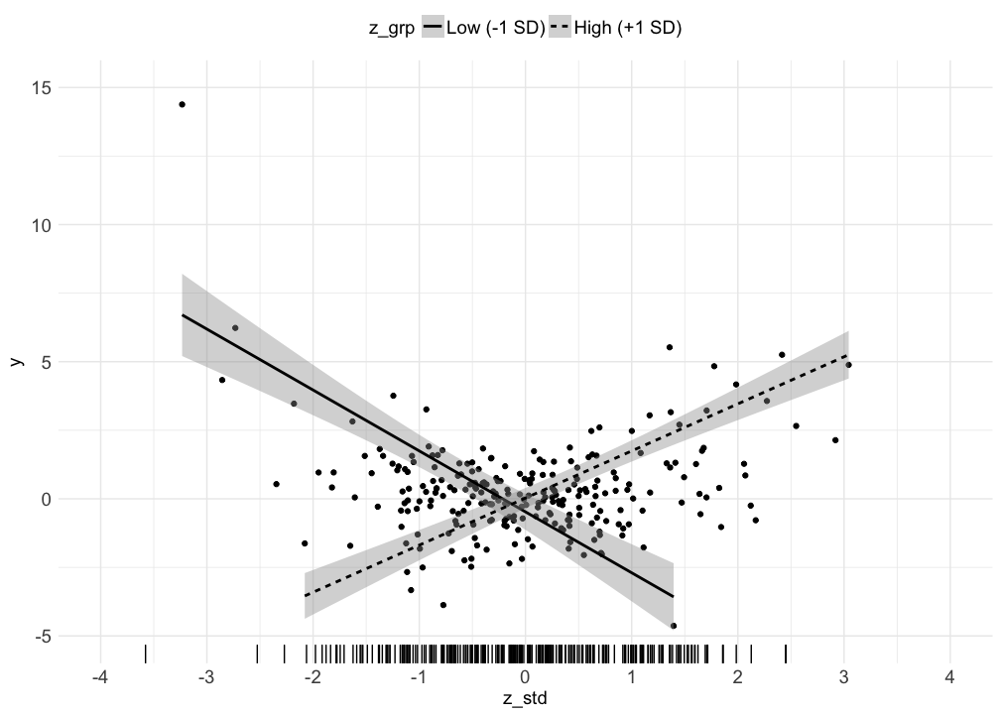

# Visualizing a 2-way interaction (continuous moderator)
Nicholas Michalak  
6/17/2017  

# packages


```r
# packages I"ll want in this analysis
want_packages <- c("tidyverse", "lavaan")

# which of those packages do I already have? (logical vector)
have_packages <- want_packages %in% rownames(installed.packages())

# if I don"t have any of those, install them
if(any(have_packages == FALSE)) install.packages(want_packages[have_packages == FALSE])

# load wanted packages
lapply(want_packages, library, character.only = TRUE)
```

```
## Loading tidyverse: ggplot2
## Loading tidyverse: tibble
## Loading tidyverse: tidyr
## Loading tidyverse: readr
## Loading tidyverse: purrr
## Loading tidyverse: dplyr
```

```
## Conflicts with tidy packages ----------------------------------------------
```

```
## filter(): dplyr, stats
## lag():    dplyr, stats
```

```
## This is lavaan 0.5-23.1097
```

```
## lavaan is BETA software! Please report any bugs.
```

```
## [[1]]
##  [1] "dplyr"     "purrr"     "readr"     "tidyr"     "tibble"   
##  [6] "ggplot2"   "tidyverse" "stats"     "graphics"  "grDevices"
## [11] "utils"     "datasets"  "methods"   "base"     
## 
## [[2]]
##  [1] "lavaan"    "dplyr"     "purrr"     "readr"     "tidyr"    
##  [6] "tibble"    "ggplot2"   "tidyverse" "stats"     "graphics" 
## [11] "grDevices" "utils"     "datasets"  "methods"   "base"
```

# data


```r
# set randomizer seed
set.seed(1234)

# random normal data
# two-way interaction
x <- rnorm(n = 250, mean = 0, sd = )
z <- x * 0.4 + rnorm(n = 250, mean = 0, sd = 1)
y <- x * z + rnorm(n = 250, mean = 0, sd = 1)

# store in a dataframe
examp_dat <- data.frame(y, x, z)

# standardize z and then make a grouping variable for visualizing high and low z (standardized)
examp_dat <- examp_dat %>%
  mutate(z_std = as.numeric(scale(z)),
         x_z_std = x * z_std,
         z_grp = ifelse(z_std < (-1), -1,
                 ifelse(z_std > 1, 1, 0)),
         z_grp = factor(z_grp, levels = c(-1, 0, 1),
                        labels = c("Low (-1 SD)",
                                   "Moderate (-1 SD ≥ z ≤ +1 SD)",
                                   "High (+1 SD)"),
                        ordered = TRUE))
```

# models


```r
# without interaction term
examp_dat %>%
  lm(y ~ x + z_std, data = .) %>%
  summary(.)
```

```
## 
## Call:
## lm(formula = y ~ x + z_std, data = .)
## 
## Residuals:
##     Min      1Q  Median      3Q     Max 
## -5.1672 -0.9687 -0.1271  0.7018 13.8515 
## 
## Coefficients:
##             Estimate Std. Error t value Pr(>|t|)   
## (Intercept)  0.32673    0.11190   2.920  0.00382 **
## x            0.01765    0.11776   0.150  0.88100   
## z_std       -0.07259    0.11981  -0.606  0.54513   
## ---
## Signif. codes:  0 '***' 0.001 '**' 0.01 '*' 0.05 '.' 0.1 ' ' 1
## 
## Residual standard error: 1.769 on 247 degrees of freedom
## Multiple R-squared:  0.001503,	Adjusted R-squared:  -0.006582 
## F-statistic: 0.1859 on 2 and 247 DF,  p-value: 0.8305
```

```r
# with interaction term
examp_dat %>%
  lm(y ~ x * z_std, data = .) %>%
  summary(.)
```

```
## 
## Call:
## lm(formula = y ~ x * z_std, data = .)
## 
## Residuals:
##      Min       1Q   Median       3Q      Max 
## -2.78989 -0.62795  0.07566  0.62157  2.44049 
## 
## Coefficients:
##             Estimate Std. Error t value Pr(>|t|)    
## (Intercept) -0.09429    0.06183  -1.525    0.129    
## x            0.01772    0.06261   0.283    0.777    
## z_std        0.06580    0.06394   1.029    0.304    
## x:z_std      1.17893    0.04706  25.053   <2e-16 ***
## ---
## Signif. codes:  0 '***' 0.001 '**' 0.01 '*' 0.05 '.' 0.1 ' ' 1
## 
## Residual standard error: 0.9407 on 246 degrees of freedom
## Multiple R-squared:  0.7188,	Adjusted R-squared:  0.7154 
## F-statistic: 209.6 on 3 and 246 DF,  p-value: < 2.2e-16
```

```r
# simple slopes
test_hi_low <- "# regressions
                  y ~ b1 * x
                  y ~ b2 * z_std
                  y ~ b3 * x_z_std

                # mean of z_std
                  z_std ~ z_std_mean * 1

                # variance of z_std
                  z_std ~~ z_std_var * z_std

                # simple slopes estimates
                  z_low := b1 + b3 * (z_std_mean - sqrt(z_std_var))
                  z_hi := b1 + b3 * (z_std_mean + sqrt(z_std_var))"

# fit model
test_hi_low %>%
  sem(data = examp_dat) %>%
  summary(.)
```

```
## Warning in lavaan::lavaan(model = ., data = examp_dat, model.type =
## "sem", : lavaan WARNING: syntax contains parameters involving exogenous
## covariates; switching to fixed.x = FALSE
```

```
## lavaan (0.5-23.1097) converged normally after  15 iterations
## 
##   Number of observations                           250
## 
##   Estimator                                         ML
##   Minimum Function Test Statistic               35.028
##   Degrees of freedom                                 2
##   P-value (Chi-square)                           0.000
## 
## Parameter Estimates:
## 
##   Information                                 Expected
##   Standard Errors                             Standard
## 
## Regressions:
##                    Estimate  Std.Err  z-value  P(>|z|)
##   y ~                                                 
##     x         (b1)    0.018    0.058    0.305    0.761
##     z_std     (b2)    0.066    0.059    1.113    0.266
##     x_z_std   (b3)    1.179    0.047   25.350    0.000
## 
## Covariances:
##                    Estimate  Std.Err  z-value  P(>|z|)
##   x ~~                                                
##     x_z_std          -0.042    0.082   -0.515    0.607
## 
## Intercepts:
##                    Estimate  Std.Err  z-value  P(>|z|)
##     z_std   (z_s_)   -0.000    0.063   -0.000    1.000
##    .y                -0.094    0.061   -1.538    0.124
##     x                -0.004    0.064   -0.064    0.949
##     x_z_std           0.357    0.080    4.447    0.000
## 
## Variances:
##                    Estimate  Std.Err  z-value  P(>|z|)
##     z_std   (z_s_)    0.996    0.089   11.180    0.000
##    .y                 0.871    0.078   11.180    0.000
##     x                 1.031    0.092   11.180    0.000
##     x_z_std           1.612    0.144   11.180    0.000
## 
## Defined Parameters:
##                    Estimate  Std.Err  z-value  P(>|z|)
##     z_low            -1.159    0.117   -9.913    0.000
##     z_hi              1.194    0.118   10.087    0.000
```

```r
# select bootstrapped estimates
test_hi_low %>%
  sem(data = examp_dat) %>%
  parameterestimates(boot.ci.type = "bca.simple",
                     level = .95,
                     ci = TRUE,
                     standardized = FALSE) %>%
  filter(lhs == "y" & op != "~~" | op == ":=" & op != "~~")
```

```
## Warning in lavaan::lavaan(model = ., data = examp_dat, model.type =
## "sem", : lavaan WARNING: syntax contains parameters involving exogenous
## covariates; switching to fixed.x = FALSE
```

```
##     lhs op                                rhs label         est         se
## 1     y  ~                                  x    b1  0.01772498 0.05815649
## 2     y  ~                              z_std    b2  0.06579734 0.05913779
## 3     y  ~                            x_z_std    b3  1.17892848 0.04650581
## 4     y ~1                                          -0.09428967 0.06131009
## 5 z_low := b1+b3*(z_std_mean-sqrt(z_std_var)) z_low -1.15884328 0.11690328
## 6  z_hi := b1+b3*(z_std_mean+sqrt(z_std_var))  z_hi  1.19429324 0.11839769
##            z    pvalue    ci.lower   ci.upper
## 1  0.3047808 0.7605331 -0.09625965  0.1317096
## 2  1.1126108 0.2658756 -0.05011060  0.1817053
## 3 25.3501316 0.0000000  1.08777877  1.2700782
## 4 -1.5379144 0.1240696 -0.21445523  0.0258759
## 5 -9.9128380 0.0000000 -1.38796950 -0.9297171
## 6 10.0871333 0.0000000  0.96223804  1.4263484
```

# traditional plot
* can't see uncertainty in regression slopes
* can't see points
* can't see how z varies with x and y


```r
examp_dat %>%
  ggplot(mapping = aes(x = x, y = y, lty = z_grp)) +
  geom_smooth(data = examp_dat %>%
                filter(z_grp != "Moderate (-1 SD ≥ z ≤ +1 SD)"),
              method = "lm", se = FALSE, color = "black") +
  scale_x_continuous(breaks = seq(-4, 4, 1), limits = c(-4, 4)) +
  scale_y_continuous(breaks = seq(-5, 15, 5), limits = c(-5, 15)) +
  theme(legend.position = "top",
        legend.title = element_text(size = 14),
        legend.text = element_text(size = 14),
        axis.title.x = element_text(size = 14),
        axis.title.y = element_text(size = 14),
        axis.text.x = element_text(size = 14),
        axis.text.y = element_text(size = 14))
```

<!-- -->

# better plot
* includes uncertainty in regression slopes
* can't see points
* can't see how z varies with x and y


```r
examp_dat %>%
  ggplot(mapping = aes(x = x, y = y, lty = z_grp)) +
  geom_smooth(data = examp_dat %>%
                filter(z_grp != "Moderate (-1 SD ≥ z ≤ +1 SD)"),
              method = "lm", se = TRUE, color = "black") +
  scale_x_continuous(breaks = seq(-4, 4, 1), limits = c(-4, 4)) +
  scale_y_continuous(breaks = seq(-5, 15, 5), limits = c(-5, 15)) +
  theme(legend.position = "top",
        legend.title = element_text(size = 14),
        legend.text = element_text(size = 14),
        axis.title.x = element_text(size = 14),
        axis.title.y = element_text(size = 14),
        axis.text.x = element_text(size = 14),
        axis.text.y = element_text(size = 14))
```

<!-- -->

# even better plot
* includes uncertainty in regression slopes
* includes points
* can't see how z varies with x and y


```r
examp_dat %>%
  ggplot(mapping = aes(x = x, y = y)) +
  geom_smooth(data = examp_dat %>%
                filter(z_grp != "Moderate (-1 SD ≥ z ≤ +1 SD)"),
              aes(lty = z_grp), method = "lm", se = TRUE, color = "black") +
  geom_point() +
  scale_x_continuous(breaks = seq(-4, 4, 1), limits = c(-4, 4)) +
  scale_y_continuous(breaks = seq(-5, 15, 5), limits = c(-5, 15)) +
  theme_minimal() +
  theme(legend.position = "top",
        legend.title = element_text(size = 14),
        legend.text = element_text(size = 14),
        axis.title.x = element_text(size = 14),
        axis.title.y = element_text(size = 14),
        axis.text.x = element_text(size = 14),
        axis.text.y = element_text(size = 14))
```

<!-- -->

# my 1st recommended (2-dimensional) plot
* includes uncertainty in regression slopes
* includes points
* includes color gradient (light to dark) to depict how z varies with x and y


```r
examp_dat %>%
  mutate(z_std = as.numeric(scale(z))) %>%
  ggplot(mapping = aes(x = x, y = y, color = z)) +
  geom_point() +
  scale_x_continuous(breaks = seq(-4, 4, 1), limits = c(-4, 4)) +
  scale_y_continuous(breaks = seq(-5, 15, 5), limits = c(-5, 15)) +
  geom_smooth(data = examp_dat %>%
                filter(z_grp != "Moderate (-1 SD ≥ z ≤ +1 SD)"),
              aes(lty = z_grp), method = "lm", se = TRUE, color = "black") +
  scale_color_gradient2() +
  theme_minimal() +
  theme(legend.position = "top",
        legend.title = element_text(size = 14),
        legend.text = element_text(size = 14),
        axis.title.x = element_text(size = 14),
        axis.title.y = element_text(size = 14),
        axis.text.x = element_text(size = 14),
        axis.text.y = element_text(size = 14))
```

<!-- -->

# my 2nd recommended (2-dimensional) plot
* includes uncertainty in regression slopes
* includes points
* includes marginal rug to depict how z varies along x and y


```r
examp_dat %>%
  mutate(z_std = as.numeric(scale(z))) %>%
  ggplot(mapping = aes(x = x, y = y)) +
  geom_point() +
  scale_x_continuous(breaks = seq(-4, 4, 1), limits = c(-4, 4)) +
  scale_y_continuous(breaks = seq(-5, 15, 5), limits = c(-5, 15)) +
  coord_cartesian(xlim = c(-4, 4), ylim = c(-5, 15)) +
  geom_smooth(data = examp_dat %>%
                filter(z_grp != "Moderate (-1 SD ≥ z ≤ +1 SD)"),
              aes(lty = z_grp), method = "lm", se = TRUE, color = "black") +
  geom_rug(aes(x = z_std), sides = "b") +
  scale_color_gradient2() +
  theme_minimal() +
  theme(legend.position = "top",
        legend.title = element_text(size = 14),
        legend.text = element_text(size = 14),
        axis.title.x = element_text(size = 14),
        axis.title.y = element_text(size = 14),
        axis.text.x = element_text(size = 14),
        axis.text.y = element_text(size = 14))
```

<!-- -->
