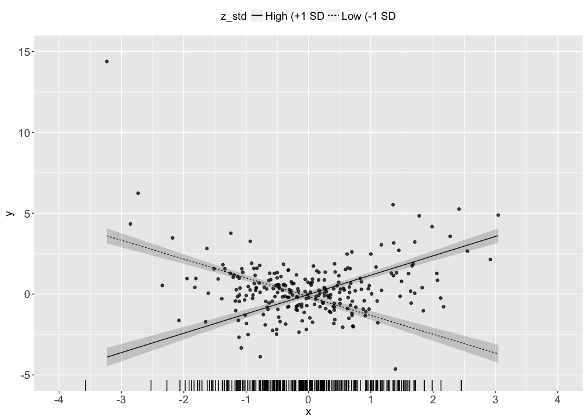
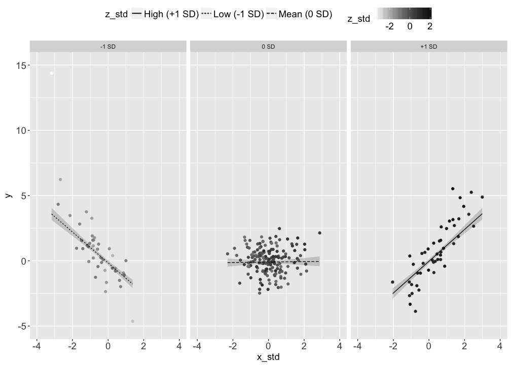

# Visualizing a 2-way interaction (continuous moderator)
Nicholas Michalak  
6/17/2017  

# packages


```r
# packages I"ll want in this analysis
want_packages <- c("tidyverse", "lavaan", "probemod", "haven")

# which of those packages do I already have? (logical vector)
have_packages <- want_packages %in% rownames(installed.packages())

# if I don"t have any of those, install them
if(any(have_packages == FALSE)) install.packages(want_packages[have_packages == FALSE])

# load wanted packages
lapply(want_packages, library, character.only = TRUE)
```

```
## Loading tidyverse: ggplot2
## Loading tidyverse: tibble
## Loading tidyverse: tidyr
## Loading tidyverse: readr
## Loading tidyverse: purrr
## Loading tidyverse: dplyr
```

```
## Conflicts with tidy packages ----------------------------------------------
```

```
## filter(): dplyr, stats
## lag():    dplyr, stats
```

```
## This is lavaan 0.5-23.1097
```

```
## lavaan is BETA software! Please report any bugs.
```

```
## [[1]]
##  [1] "dplyr"     "purrr"     "readr"     "tidyr"     "tibble"   
##  [6] "ggplot2"   "tidyverse" "stats"     "graphics"  "grDevices"
## [11] "utils"     "datasets"  "methods"   "base"     
## 
## [[2]]
##  [1] "lavaan"    "dplyr"     "purrr"     "readr"     "tidyr"    
##  [6] "tibble"    "ggplot2"   "tidyverse" "stats"     "graphics" 
## [11] "grDevices" "utils"     "datasets"  "methods"   "base"     
## 
## [[3]]
##  [1] "probemod"  "lavaan"    "dplyr"     "purrr"     "readr"    
##  [6] "tidyr"     "tibble"    "ggplot2"   "tidyverse" "stats"    
## [11] "graphics"  "grDevices" "utils"     "datasets"  "methods"  
## [16] "base"     
## 
## [[4]]
##  [1] "haven"     "probemod"  "lavaan"    "dplyr"     "purrr"    
##  [6] "readr"     "tidyr"     "tibble"    "ggplot2"   "tidyverse"
## [11] "stats"     "graphics"  "grDevices" "utils"     "datasets" 
## [16] "methods"   "base"
```

# data


```r
# set randomizer seed
set.seed(1234)

# random normal data
# two-way interaction
x <- rnorm(n = 250, mean = 0, sd = )
z <- x * 0.4 + rnorm(n = 250, mean = 0, sd = 1)
y <- x * z + rnorm(n = 250, mean = 0, sd = 1)

# store in a dataframe
examp_dat <- data.frame(y, x, z)

# standardize z and then make a grouping variable for visualizing high and low z (standardized)
examp_dat <- examp_dat %>%
  mutate(z_std = as.numeric(scale(z)),
         x_std = as.numeric(scale(x)),
         x_z_std = x_std * z_std)
```

# write data to file


```r
examp_dat %>%
  write_csv(path = "examp_dat.csv")
```

# models


```r
# without interaction term
examp_dat %>%
  lm(y ~ x_std * z_std, data = .) %>%
  summary(.)
```

```
## 
## Call:
## lm(formula = y ~ x_std * z_std, data = .)
## 
## Residuals:
##      Min       1Q   Median       3Q      Max 
## -2.78989 -0.62795  0.07566  0.62157  2.44049 
## 
## Coefficients:
##             Estimate Std. Error t value Pr(>|t|)    
## (Intercept) -0.09436    0.06183  -1.526    0.128    
## x_std        0.01803    0.06370   0.283    0.777    
## z_std        0.06099    0.06393   0.954    0.341    
## x_std:z_std  1.19946    0.04788  25.053   <2e-16 ***
## ---
## Signif. codes:  0 '***' 0.001 '**' 0.01 '*' 0.05 '.' 0.1 ' ' 1
## 
## Residual standard error: 0.9407 on 246 degrees of freedom
## Multiple R-squared:  0.7188,	Adjusted R-squared:  0.7154 
## F-statistic: 209.6 on 3 and 246 DF,  p-value: < 2.2e-16
```

```r
# with interaction term
examp_dat %>%
  lm(y ~ x_std * z_std, data = .) %>%
  summary(.)
```

```
## 
## Call:
## lm(formula = y ~ x_std * z_std, data = .)
## 
## Residuals:
##      Min       1Q   Median       3Q      Max 
## -2.78989 -0.62795  0.07566  0.62157  2.44049 
## 
## Coefficients:
##             Estimate Std. Error t value Pr(>|t|)    
## (Intercept) -0.09436    0.06183  -1.526    0.128    
## x_std        0.01803    0.06370   0.283    0.777    
## z_std        0.06099    0.06393   0.954    0.341    
## x_std:z_std  1.19946    0.04788  25.053   <2e-16 ***
## ---
## Signif. codes:  0 '***' 0.001 '**' 0.01 '*' 0.05 '.' 0.1 ' ' 1
## 
## Residual standard error: 0.9407 on 246 degrees of freedom
## Multiple R-squared:  0.7188,	Adjusted R-squared:  0.7154 
## F-statistic: 209.6 on 3 and 246 DF,  p-value: < 2.2e-16
```

```r
# simple slopes function
test_slopes <- function(y, x, z, sd_values = seq(-3, 3, 0.5), alpha = .05) {
  # Computes confidence intervals and test statistics at 3 moderator values: -1 SD, Mean, and +1 SD
  # Arguments: 
  #   y:         outcome variable
  #   x:         predictor variable
  #   z:         moderator variable
  #   sd_values: standard deviation values for testing slopes
  #   alpha:     alpha level for 1-alpha confidence
  # Returns:
  #   table of values for each of three tests: test names, estimates, standard errors, t-statistics,
  #   p-values, and lower and upper confidence intervals
  
  # fit model
  model <- lm(y ~ x * z)
  
  # mean of z
  z_mean <- mean(z, na.rm = TRUE)
  
  # sd of z
  z_sd <- sd(z, na.rm = TRUE)
  
  # model covariance matrix
  model_vcov <- vcov(model)
  
  est <- list()
  se <- list()
  for(i in 1:length(sd_values)) {
    est[[i]] <- coefficients(model)["x"] + coefficients(model)["x:z"] * (z_mean + sd_values[i] * z_sd)
    se[[i]] <- sqrt(model_vcov["x", "x"] + 2 * (z_mean + sd_values[i] * z_sd) * model_vcov["x", "x:z"] + (z_mean + sd_values[i] * z_sd) * (z_mean + sd_values[i] * z_sd) * model_vcov["x:z", "x:z"])
  }
  
  # result table: estimates and standard errors
  result <- data.frame(test = paste0(sd_values, " SD"),
                       est = unlist(est),
                       se = unlist(se))
  
  # t-statistics
  result$t_val <- with(data = result, est / se)
  
  # p-values
  result$p_val <- with(data = result, 2 * pt(q = -abs(t_val), df = model$df.residual))
  
  # t-critical
  t_crit <- qt(p = 1 - alpha / 2, df = model$df.residual)
  
  # lower confidence intervals
  result$lwr_ci <- with(data = result, est - t_crit * se)
  
  # upper confidence intervals
  result$upr_ci <- with(data = result, est + t_crit * se)
  
  return(result)
}

# simple slopes with custom function
with(examp_dat, test_slopes(y = y, x = x_std, z = z_std, alpha = .05))
```

```
##       test         est         se       t_val        p_val     lwr_ci
## 1    -3 SD -3.58033830 0.15712343 -22.7867881 1.470571e-62 -3.8898171
## 2  -2.5 SD -2.98060965 0.13558819 -21.9828113 5.573830e-60 -3.2476715
## 3    -2 SD -2.38088099 0.11500732 -20.7019959 8.279795e-56 -2.6074056
## 4  -1.5 SD -1.78115233 0.09599660 -18.5543275 1.170238e-48 -1.9702324
## 5    -1 SD -1.18142368 0.07968783 -14.8256472 5.803386e-36 -1.3383812
## 6  -0.5 SD -0.58169502 0.06805214  -8.5477849 1.343849e-15 -0.7157342
## 7     0 SD  0.01803363 0.06370381   0.2830856 7.773493e-01 -0.1074408
## 8   0.5 SD  0.61776229 0.06805437   9.0774820 3.702606e-17  0.4837187
## 9     1 SD  1.21749094 0.07969164  15.2775241 1.657131e-37  1.0605260
## 10  1.5 SD  1.81721960 0.09600134  18.9291065 6.431428e-50  1.6281302
## 11    2 SD  2.41694825 0.11501259  21.0146401 7.811694e-57  2.1904132
## 12  2.5 SD  3.01667691 0.13559379  22.2478992 7.805274e-61  2.7496040
## 13    3 SD  3.61640556 0.15712922  23.0154867 2.753366e-63  3.3069153
##        upr_ci
## 1  -3.2708595
## 2  -2.7135478
## 3  -2.1543563
## 4  -1.5920722
## 5  -1.0244662
## 6  -0.4476558
## 7   0.1435081
## 8   0.7518059
## 9   1.3744559
## 10  2.0063090
## 11  2.6434833
## 12  3.2837498
## 13  3.9258958
```

```r
# alternatively, simple slopes with sem from lavaan
test_hi_low <- "# regressions
                  y ~ b1 * x_std
                  y ~ b2 * z_std
                  y ~ b3 * x_z_std

                # mean of z_std
                  z_std ~ z_std_mean * 1

                # variance of z_std
                  z_std ~~ z_std_var * z_std

                # simple slopes estimates
                  z_low := b1 + b3 * (z_std_mean - sqrt(z_std_var))
                  z_mean := b1 + b3 * (z_std_mean)
                  z_hi := b1 + b3 * (z_std_mean + sqrt(z_std_var))"

# fit model
test_hi_low %>%
  sem(data = examp_dat) %>%
  summary(.)
```

```
## Warning in lavaan::lavaan(model = ., data = examp_dat, model.type =
## "sem", : lavaan WARNING: syntax contains parameters involving exogenous
## covariates; switching to fixed.x = FALSE
```

```
## lavaan (0.5-23.1097) converged normally after  15 iterations
## 
##   Number of observations                           250
## 
##   Estimator                                         ML
##   Minimum Function Test Statistic               34.900
##   Degrees of freedom                                 2
##   P-value (Chi-square)                           0.000
## 
## Parameter Estimates:
## 
##   Information                                 Expected
##   Standard Errors                             Standard
## 
## Regressions:
##                    Estimate  Std.Err  z-value  P(>|z|)
##   y ~                                                 
##     x_std     (b1)    0.018    0.059    0.305    0.761
##     z_std     (b2)    0.061    0.059    1.031    0.302
##     x_z_std   (b3)    1.199    0.047   25.344    0.000
## 
## Covariances:
##                    Estimate  Std.Err  z-value  P(>|z|)
##   x_std ~~                                            
##     x_z_std          -0.039    0.079   -0.497    0.619
## 
## Intercepts:
##                    Estimate  Std.Err  z-value  P(>|z|)
##     z_std   (z_s_)   -0.000    0.063   -0.000    1.000
##    .y                -0.094    0.061   -1.539    0.124
##     x_std             0.000    0.063    0.000    1.000
##     x_z_std           0.351    0.079    4.448    0.000
## 
## Variances:
##                    Estimate  Std.Err  z-value  P(>|z|)
##     z_std   (z_s_)    0.996    0.089   11.180    0.000
##    .y                 0.871    0.078   11.180    0.000
##     x_std             0.996    0.089   11.180    0.000
##     x_z_std           1.557    0.139   11.180    0.000
## 
## Defined Parameters:
##                    Estimate  Std.Err  z-value  P(>|z|)
##     z_low            -1.179    0.119   -9.910    0.000
##     z_mean            0.018    0.096    0.188    0.851
##     z_hi              1.215    0.120   10.089    0.000
```

```r
# select bootstrapped estimates
test_hi_low %>%
  sem(data = examp_dat) %>%
  parameterestimates(boot.ci.type = "bca.simple",
                     level = .95,
                     ci = TRUE,
                     standardized = FALSE) %>%
  filter(lhs == "y" & op != "~~" | op == ":=" & op != "~~")
```

```
## Warning in lavaan::lavaan(model = ., data = examp_dat, model.type =
## "sem", : lavaan WARNING: syntax contains parameters involving exogenous
## covariates; switching to fixed.x = FALSE
```

```
##      lhs op                                rhs  label         est
## 1      y  ~                              x_std     b1  0.01803366
## 2      y  ~                              z_std     b2  0.06098860
## 3      y  ~                            x_z_std     b3  1.19945730
## 4      y ~1                                           -0.09436195
## 5  z_low := b1+b3*(z_std_mean-sqrt(z_std_var))  z_low -1.17902234
## 6 z_mean :=                 b1+b3*(z_std_mean) z_mean  0.01803366
## 7   z_hi := b1+b3*(z_std_mean+sqrt(z_std_var))   z_hi  1.21508966
##           se          z    pvalue    ci.lower    ci.upper
## 1 0.05916706  0.3047922 0.7605244 -0.09793164  0.13399896
## 2 0.05913779  1.0312966 0.3024017 -0.05491934  0.17689654
## 3 0.04732769 25.3436707 0.0000000  1.10669674  1.29221786
## 4 0.06131287 -1.5390236 0.1237985 -0.21453297  0.02580906
## 5 0.11896882 -9.9103477 0.0000000 -1.41219694 -0.94584774
## 6 0.09608597  0.1876825 0.8511255 -0.17029137  0.20635869
## 7 0.12043720 10.0889896 0.0000000  0.97903708  1.45114223
```

```r
# Johnson-Neyman
examp_dat %>%
  lm(y ~ x_std * z_std, data = .) %>%
  jn(dv = "y", iv = "x_std", mod = "z_std", alpha = .05)
```

```
## Call:
## jn(model = ., dv = "y", iv = "x_std", mod = "z_std", alpha = 0.05)
## 
## Conditional effects of  x_std  on  y  at values of  z_std 
##  z_std Effect     se       t p   llci   ulci
##      1 1.2175 0.0797 15.2775 0 1.0605 1.3745
##      2 2.4169 0.1150 21.0146 0 2.1904 2.6435
##      3 3.6164 0.1571 23.0155 0 3.3069 3.9259
##      4 4.8159 0.2018 23.8608 0 4.4183 5.2134
##      5 6.0153 0.2477 24.2825 0 5.5274 6.5033
##      6 7.2148 0.2942 24.5194 0 6.6352 7.7944
##      7 8.4142 0.3411 24.6645 0 7.7423 9.0862
```

# data for plotting simple slopes


```r
model_int <- examp_dat %>%
  lm(y ~ x_std * z_std, data = .)

low <- examp_dat %>%
  lm(y ~ x_std * z_std, data = .) %>%
  predict.lm(newdata = data.frame(x_std = examp_dat$x_std, z_std = mean(examp_dat$z_std) - sd(examp_dat$z_std)),
             se.fit = TRUE,
             interval = "confidence") %>%
  .$fit %>%
  data.frame(.)

avg <- examp_dat %>%
  lm(y ~ x_std * z_std, data = .) %>%
  predict.lm(newdata = data.frame(x_std = examp_dat$x_std, z_std = mean(examp_dat$z_std)),
             se.fit = TRUE,
             interval = "confidence") %>%
  .$fit %>%
  data.frame(.)

hi <- examp_dat %>%
  lm(y ~ x_std * z_std, data = .) %>%
  predict.lm(newdata = data.frame(x_std = examp_dat$x_std, z_std = mean(examp_dat$z_std) + sd(examp_dat$z_std)),
             se.fit = TRUE,
             interval = "confidence") %>%
  .$fit %>%
  data.frame(.)

examp_dat <- examp_dat %>%
  mutate(z_std_group = ifelse(z_std < (-1), -1,
                       ifelse(z_std > 1, 1, 0)),
         z_std_group = factor(z_std_group,
                              levels = c(-1, 0, 1),
                              labels = c("-1 SD", "0 SD", "+1 SD"),
                              ordered = TRUE),
         low_fit = as.numeric(low$fit),
         low_lwr = as.numeric(low$lwr),
         low_upr = as.numeric(low$upr),
         avg_fit = as.numeric(avg$fit),
         avg_lwr = as.numeric(avg$lwr),
         avg_upr = as.numeric(avg$upr),
         hi_fit = as.numeric(hi$fit),
         hi_lwr = as.numeric(hi$lwr),
         hi_upr = as.numeric(hi$upr))
```

# traditional plot
* can't see uncertainty in regression slopes
* can't see points
* can't see how z varies with x and y


```r
examp_dat %>%
  ggplot(mapping = aes(x = x_std, y = y)) +
  geom_line(aes(y = low_fit, linetype = "Low (-1 SD)")) +
  geom_line(aes(y = hi_fit, linetype = "High (+1 SD)")) +
  scale_x_continuous(breaks = seq(-4, 4, 1), limits = c(-4, 4)) +
  scale_y_continuous(breaks = seq(-5, 15, 5), limits = c(-5, 15)) +
  theme(legend.position = "top",
        legend.title = element_text(size = 14),
        legend.text = element_text(size = 14),
        axis.title.x = element_text(size = 14),
        axis.title.y = element_text(size = 14),
        axis.text.x = element_text(size = 14),
        axis.text.y = element_text(size = 14)) +
  labs(linetype = "z_std")
```

<!-- -->

# better plot
* includes uncertainty in regression slopes
* can't see points
* can't see how z varies with x and y


```r
examp_dat %>%
  ggplot(mapping = aes(x = x_std, y = y)) +
  geom_line(aes(y = low_fit, linetype = "Low (-1 SD)")) +
  geom_line(aes(y = hi_fit, linetype = "High (+1 SD)")) +
  geom_ribbon(aes(ymin = low_lwr, max = low_upr), alpha = 0.2) +
  geom_ribbon(aes(ymin = hi_lwr, max = hi_upr), alpha = 0.2) +
  scale_x_continuous(breaks = seq(-4, 4, 1), limits = c(-4, 4)) +
  scale_y_continuous(breaks = seq(-5, 15, 5), limits = c(-5, 15)) +
  theme(legend.position = "top",
        legend.title = element_text(size = 14),
        legend.text = element_text(size = 14),
        axis.title.x = element_text(size = 14),
        axis.title.y = element_text(size = 14),
        axis.text.x = element_text(size = 14),
        axis.text.y = element_text(size = 14)) +
  labs(linetype = "z_std")
```

<!-- -->

# even better plot
* includes uncertainty in regression slopes
* includes points
* can't see how z varies with x and y


```r
examp_dat %>%
  ggplot(mapping = aes(x = x_std, y = y)) +
  geom_point(alpha = 0.75) +
  geom_line(aes(y = low_fit, linetype = "Low (-1 SD)")) +
  geom_line(aes(y = hi_fit, linetype = "High (+1 SD)")) +
  geom_ribbon(aes(ymin = low_lwr, max = low_upr), alpha = 0.2) +
  geom_ribbon(aes(ymin = hi_lwr, max = hi_upr), alpha = 0.2) +
  scale_x_continuous(breaks = seq(-4, 4, 1), limits = c(-4, 4)) +
  scale_y_continuous(breaks = seq(-5, 15, 5), limits = c(-5, 15)) +
  theme(legend.position = "top",
        legend.title = element_text(size = 14),
        legend.text = element_text(size = 14),
        axis.title.x = element_text(size = 14),
        axis.title.y = element_text(size = 14),
        axis.text.x = element_text(size = 14),
        axis.text.y = element_text(size = 14)) +
  labs(linetype = "z_std")
```

<!-- -->

# 1st recommended (2-dimensional) plot
* includes uncertainty in regression slopes
* includes points
* includes color gradient (light to dark) to depict how z varies with x and y


```r
examp_dat %>%
  ggplot(mapping = aes(x = x_std, y = y)) +
  geom_point(aes(color = z_std)) +
  geom_line(aes(y = low_fit, linetype = "Low (-1 SD)")) +
  geom_line(aes(y = hi_fit, linetype = "High (+1 SD)")) +
  geom_ribbon(aes(ymin = low_lwr, max = low_upr), alpha = 0.2) +
  geom_ribbon(aes(ymin = hi_lwr, max = hi_upr), alpha = 0.2) +
  scale_y_continuous(breaks = seq(-5, 15, 5), limits = c(-5, 15)) +
  scale_color_gradient(low = "white", high = "black") +
  theme(legend.position = "top",
        legend.title = element_text(size = 14),
        legend.text = element_text(size = 14),
        axis.title.x = element_text(size = 14),
        axis.title.y = element_text(size = 14),
        axis.text.x = element_text(size = 14),
        axis.text.y = element_text(size = 14)) +
  labs(linetype = "z_std")
```

<!-- -->

# 2nd recommended (2-dimensional) plot
* includes uncertainty in regression slopes
* includes points
* includes marginal rug to depict how z varies along x and y


```r
examp_dat %>%
  ggplot(mapping = aes(x = x_std, y = y)) +
  geom_point(alpha = 0.75) +
  geom_line(aes(y = low_fit, linetype = "Low (-1 SD)")) +
  geom_line(aes(y = hi_fit, linetype = "High (+1 SD)")) +
  geom_ribbon(aes(ymin = low_lwr, max = low_upr), alpha = 0.2) +
  geom_ribbon(aes(ymin = hi_lwr, max = hi_upr), alpha = 0.2) +
  geom_rug(aes(x = z_std), sides = "b") +
  scale_x_continuous(breaks = seq(-4, 4, 1), limits = c(-4, 4)) +
  scale_y_continuous(breaks = seq(-5, 15, 5), limits = c(-5, 15)) +
  scale_color_gradient(low = "white", high = "black") +
  theme(legend.position = "top",
        legend.title = element_text(size = 14),
        legend.text = element_text(size = 14),
        axis.title.x = element_text(size = 14),
        axis.title.y = element_text(size = 14),
        axis.text.x = element_text(size = 14),
        axis.text.y = element_text(size = 14)) +
  labs(linetype = "z_std")
```

<!-- -->

# 3rd recommended (2-dimensional) plot
* includes uncertainty in regression slopes
* includes points
* includes color gradient (light to dark) to depict how z varies with x and y
* includes slopes at multiple levels of z


```r
examp_dat %>%
  ggplot(mapping = aes(x = x_std, y = y)) +
  geom_point(aes(color = z_std)) +
  facet_wrap(~ z_std_group) +
  geom_line(data = examp_dat %>%
              filter(z_std_group == "-1 SD"), aes(y = low_fit, linetype = "Low (-1 SD)")) +
  geom_line(data = examp_dat %>%
              filter(z_std_group == "0 SD"), aes(y = avg_fit, linetype = "Mean (0 SD)")) +
  geom_line(data = examp_dat %>%
              filter(z_std_group == "+1 SD"), aes(y = hi_fit, linetype = "High (+1 SD)")) +
  geom_ribbon(data = examp_dat %>%
              filter(z_std_group == "-1 SD"), aes(ymin = low_lwr, ymax = low_upr), alpha = 0.2) +
  geom_ribbon(data = examp_dat %>%
              filter(z_std_group == "0 SD"), aes(ymin = avg_lwr, ymax = avg_upr), alpha = 0.2) +
  geom_ribbon(data = examp_dat %>%
              filter(z_std_group == "+1 SD"), aes(ymin = hi_lwr, ymax = hi_upr), alpha = 0.2) +
  scale_x_continuous(breaks = seq(-4, 4, 2), limits = c(-4, 4)) +
  scale_y_continuous(breaks = seq(-5, 15, 5), limits = c(-5, 15)) +
  scale_color_gradient(low = "white", high = "black") +
  theme(legend.position = "top",
        legend.title = element_text(size = 14),
        legend.text = element_text(size = 14),
        axis.title.x = element_text(size = 14),
        axis.title.y = element_text(size = 14),
        axis.text.x = element_text(size = 14),
        axis.text.y = element_text(size = 14)) +
  labs(linetype = "z_std")
```

<!-- -->

