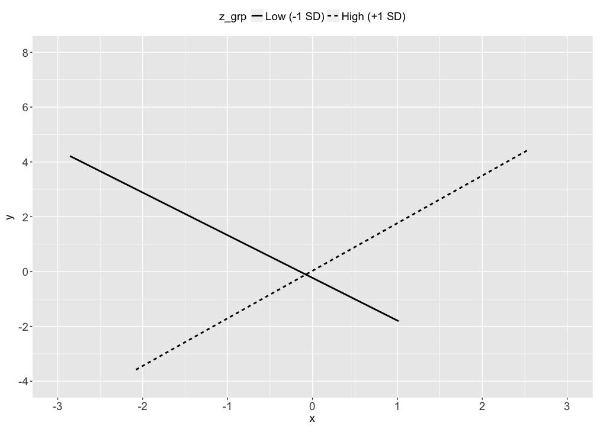
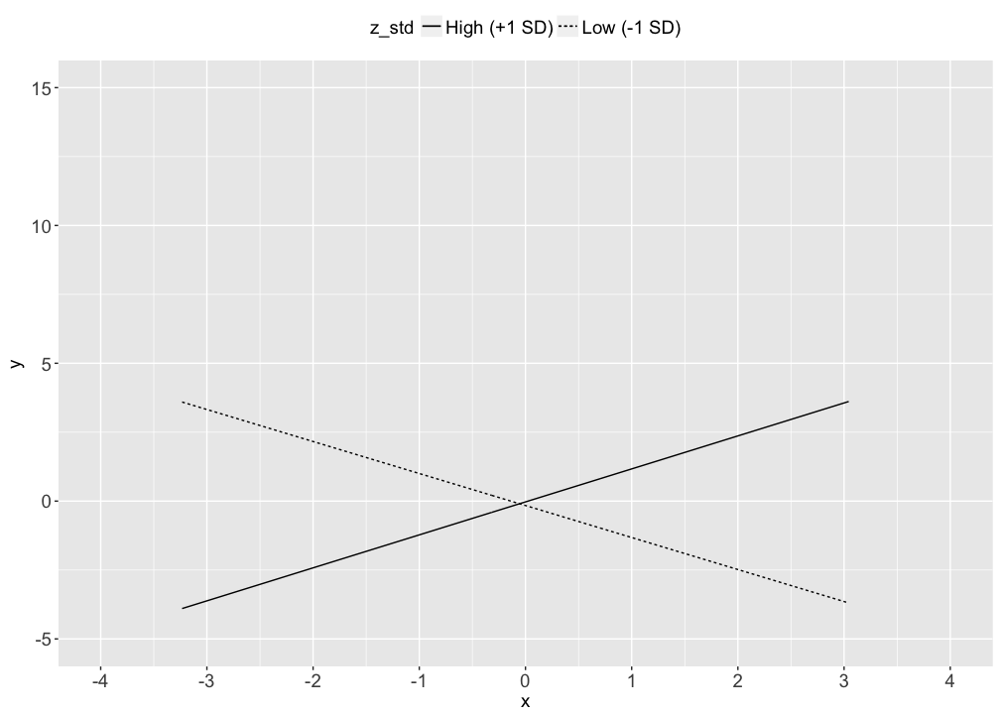
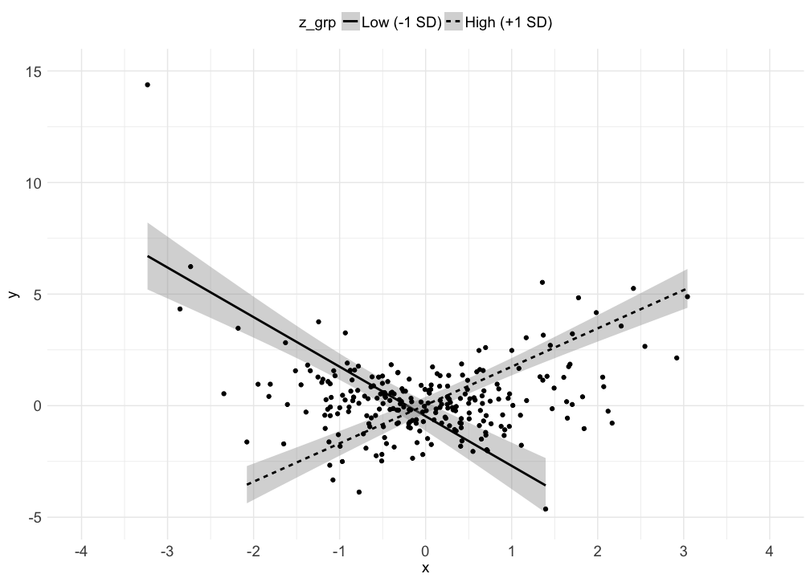

# Visualizing a 2-way interaction (continuous moderator)
Nicholas Michalak  
6/17/2017  

# packages


```r
# packages I"ll want in this analysis
want_packages <- c("tidyverse", "lavaan")

# which of those packages do I already have? (logical vector)
have_packages <- want_packages %in% rownames(installed.packages())

# if I don"t have any of those, install them
if(any(have_packages == FALSE)) install.packages(want_packages[have_packages == FALSE])

# load wanted packages
lapply(want_packages, library, character.only = TRUE)
```

```
## Loading tidyverse: ggplot2
## Loading tidyverse: tibble
## Loading tidyverse: tidyr
## Loading tidyverse: readr
## Loading tidyverse: purrr
## Loading tidyverse: dplyr
```

```
## Conflicts with tidy packages ----------------------------------------------
```

```
## filter(): dplyr, stats
## lag():    dplyr, stats
```

```
## This is lavaan 0.5-23.1097
```

```
## lavaan is BETA software! Please report any bugs.
```

```
## [[1]]
##  [1] "dplyr"     "purrr"     "readr"     "tidyr"     "tibble"   
##  [6] "ggplot2"   "tidyverse" "stats"     "graphics"  "grDevices"
## [11] "utils"     "datasets"  "methods"   "base"     
## 
## [[2]]
##  [1] "lavaan"    "dplyr"     "purrr"     "readr"     "tidyr"    
##  [6] "tibble"    "ggplot2"   "tidyverse" "stats"     "graphics" 
## [11] "grDevices" "utils"     "datasets"  "methods"   "base"
```

# data


```r
# set randomizer seed
set.seed(1234)

# random normal data
# two-way interaction
x <- rnorm(n = 100, mean = 0, sd = )
z <- x * 0.4 + rnorm(n = 100, mean = 0, sd = 1)
y <- x * z + rnorm(n = 100, mean = 0, sd = 1)

# store in a dataframe
examp_dat <- data.frame(y, x, z)

# standardize z and then make a grouping variable for visualizing high and low z (standardized)
examp_dat <- examp_dat %>%
  mutate(z_std = as.numeric(scale(z)),
         x_z_std = x * z_std,
         z_grp = ifelse(z_std < (-1), -1,
                 ifelse(z_std > 1, 1, 0)),
         z_grp = factor(z_grp, levels = c(-1, 0, 1),
                        labels = c("Low (-1 SD)",
                                   "Moderate (-1 SD ≥ z ≤ +1 SD)",
                                   "High (+1 SD)"),
                        ordered = TRUE))
```

# models


```r
# without interaction term
examp_dat %>%
  lm(y ~ x + z_std, data = .) %>%
  summary(.)
```

```
## 
## Call:
## lm(formula = y ~ x + z_std, data = .)
## 
## Residuals:
##     Min      1Q  Median      3Q     Max 
## -3.3052 -0.8771 -0.1415  0.5552  6.2626 
## 
## Coefficients:
##             Estimate Std. Error t value Pr(>|t|)    
## (Intercept)   0.5507     0.1425   3.863 0.000202 ***
## x             0.1230     0.1497   0.821 0.413514    
## z_std        -0.1857     0.1504  -1.235 0.219825    
## ---
## Signif. codes:  0 '***' 0.001 '**' 0.01 '*' 0.05 '.' 0.1 ' ' 1
## 
## Residual standard error: 1.406 on 97 degrees of freedom
## Multiple R-squared:  0.01728,	Adjusted R-squared:  -0.002985 
## F-statistic: 0.8527 on 2 and 97 DF,  p-value: 0.4294
```

```r
# with interaction term
examp_dat %>%
  lm(y ~ x * z_std, data = .) %>%
  summary(.)
```

```
## 
## Call:
## lm(formula = y ~ x * z_std, data = .)
## 
## Residuals:
##      Min       1Q   Median       3Q      Max 
## -3.06188 -0.62230  0.09497  0.55913  2.71666 
## 
## Coefficients:
##             Estimate Std. Error t value Pr(>|t|)    
## (Intercept)  0.18638    0.10380   1.796   0.0757 .  
## x            0.03002    0.10312   0.291   0.7716    
## z_std        0.07904    0.10623   0.744   0.4587    
## x:z_std      1.02838    0.09807  10.487   <2e-16 ***
## ---
## Signif. codes:  0 '***' 0.001 '**' 0.01 '*' 0.05 '.' 0.1 ' ' 1
## 
## Residual standard error: 0.9648 on 96 degrees of freedom
## Multiple R-squared:  0.542,	Adjusted R-squared:  0.5277 
## F-statistic: 37.86 on 3 and 96 DF,  p-value: 3.092e-16
```

```r
# simple slopes
test_hi_low <- "# regressions
                  y ~ b1 * x
                  y ~ b2 * z_std
                  y ~ b3 * x_z_std

                # mean of z_std
                  z_std ~ z_std_mean * 1

                # variance of z_std
                  z_std ~~ z_std_var * z_std

                # simple slopes estimates
                  z_low := b1 + b3 * (z_std_mean - sqrt(z_std_var))
                  z_hi := b1 + b3 * (z_std_mean + sqrt(z_std_var))"

# fit model
test_hi_low %>%
  sem(data = examp_dat) %>%
  summary(.)
```

```
## Warning in lavaan::lavaan(model = ., data = examp_dat, model.type =
## "sem", : lavaan WARNING: syntax contains parameters involving exogenous
## covariates; switching to fixed.x = FALSE
```

```
## lavaan (0.5-23.1097) converged normally after  13 iterations
## 
##   Number of observations                           100
## 
##   Estimator                                         ML
##   Minimum Function Test Statistic               18.253
##   Degrees of freedom                                 2
##   P-value (Chi-square)                           0.000
## 
## Parameter Estimates:
## 
##   Information                                 Expected
##   Standard Errors                             Standard
## 
## Regressions:
##                    Estimate  Std.Err  z-value  P(>|z|)
##   y ~                                                 
##     x         (b1)    0.030    0.095    0.317    0.751
##     z_std     (b2)    0.079    0.095    0.832    0.405
##     x_z_std   (b3)    1.028    0.093   11.019    0.000
## 
## Covariances:
##                    Estimate  Std.Err  z-value  P(>|z|)
##   x ~~                                                
##     x_z_std           0.003    0.101    0.027    0.979
## 
## Intercepts:
##                    Estimate  Std.Err  z-value  P(>|z|)
##     z_std   (z_s_)   -0.000    0.099   -0.000    1.000
##    .y                 0.186    0.101    1.848    0.065
##     x                -0.157    0.100   -1.569    0.117
##     x_z_std           0.340    0.101    3.358    0.001
## 
## Variances:
##                    Estimate  Std.Err  z-value  P(>|z|)
##     z_std   (z_s_)    0.990    0.140    7.071    0.000
##    .y                 0.894    0.126    7.071    0.000
##     x                 0.999    0.141    7.071    0.000
##     x_z_std           1.026    0.145    7.071    0.000
## 
## Defined Parameters:
##                    Estimate  Std.Err  z-value  P(>|z|)
##     z_low            -0.993    0.183   -5.441    0.000
##     z_hi              1.053    0.182    5.778    0.000
```

```r
# select bootstrapped estimates
test_hi_low %>%
  sem(data = examp_dat) %>%
  parameterestimates(boot.ci.type = "bca.simple",
                     level = .95,
                     ci = TRUE,
                     standardized = FALSE) %>%
  filter(lhs == "y" & op != "~~" | op == ":=" & op != "~~")
```

```
## Warning in lavaan::lavaan(model = ., data = examp_dat, model.type =
## "sem", : lavaan WARNING: syntax contains parameters involving exogenous
## covariates; switching to fixed.x = FALSE
```

```
##     lhs op                                rhs label         est         se
## 1     y  ~                                  x    b1  0.03002322 0.09459260
## 2     y  ~                              z_std    b2  0.07903846 0.09500897
## 3     y  ~                            x_z_std    b3  1.02837743 0.09333149
## 4     y ~1                                           0.18637835 0.10082821
## 5 z_low := b1+b3*(z_std_mean-sqrt(z_std_var)) z_low -0.99319939 0.18254593
## 6  z_hi := b1+b3*(z_std_mean+sqrt(z_std_var))  z_hi  1.05324584 0.18228922
##            z       pvalue    ci.lower   ci.upper
## 1  0.3173951 7.509439e-01 -0.15537487  0.2154213
## 2  0.8319053 4.054624e-01 -0.10717570  0.2652526
## 3 11.0185469 0.000000e+00  0.84545107  1.2113038
## 4  1.8484741 6.453378e-02 -0.01124132  0.3839980
## 5 -5.4408191 5.303614e-08 -1.35098284 -0.6354159
## 6  5.7778833 7.564623e-09  0.69596554  1.4105261
```

# traditional plot
* can't see uncertainty in regression slopes
* can't see points
* can't see how z varies with x and y


```r
examp_dat %>%
  filter(z_grp != "Moderate (-1 SD ≥ z ≤ +1 SD)") %>%
  ggplot(mapping = aes(x = x, y = y, lty = z_grp)) +
  geom_smooth(method = "lm", se = FALSE, color = "black") +
  scale_x_continuous(breaks = seq(-3, 3, 1), limits = c(-3, 3)) +
  scale_y_continuous(breaks = seq(-4, 8, 2), limits = c(-4, 8)) +
  theme(legend.position = "top",
        legend.title = element_text(size = 14),
        legend.text = element_text(size = 14),
        axis.title.x = element_text(size = 14),
        axis.title.y = element_text(size = 14),
        axis.text.x = element_text(size = 14),
        axis.text.y = element_text(size = 14))
```

<!-- -->

# better plot
* includes uncertainty in regression slopes
* can't see points
* can't see how z varies with x and y


```r
examp_dat %>%
  filter(z_grp != "Moderate (-1 SD ≥ z ≤ +1 SD)") %>%
  ggplot(mapping = aes(x = x, y = y, lty = z_grp)) +
  geom_smooth(method = "lm", se = TRUE, color = "black") +
  scale_x_continuous(breaks = seq(-3, 3, 1), limits = c(-3, 3)) +
  scale_y_continuous(breaks = seq(-4, 8, 2), limits = c(-4, 8)) +
  theme(legend.position = "top",
        legend.title = element_text(size = 14),
        legend.text = element_text(size = 14),
        axis.title.x = element_text(size = 14),
        axis.title.y = element_text(size = 14),
        axis.text.x = element_text(size = 14),
        axis.text.y = element_text(size = 14))
```

<!-- -->

# even better plot
* includes uncertainty in regression slopes
* includes points
* can't see how z varies with x and y


```r
examp_dat %>%
  filter(z_grp != "Moderate (-1 SD ≥ z ≤ +1 SD)") %>%
  ggplot(mapping = aes(x = x, y = y, lty = z_grp, color = z_grp)) +
  geom_smooth(method = "lm", se = TRUE, color = "black") +
  geom_point() +
  scale_color_manual(values = c("red", "blue")) +
  scale_x_continuous(breaks = seq(-3, 3, 1), limits = c(-3, 3)) +
  scale_y_continuous(breaks = seq(-4, 8, 2), limits = c(-4, 8)) +
  theme_minimal() +
  theme(legend.position = "top",
        legend.title = element_text(size = 14),
        legend.text = element_text(size = 14),
        axis.title.x = element_text(size = 14),
        axis.title.y = element_text(size = 14),
        axis.text.x = element_text(size = 14),
        axis.text.y = element_text(size = 14))
```

<!-- -->

# my recommended (2-dimensional) plot
* includes uncertainty in regression slopes
* includes points
* includes how z varies with x and y


```r
examp_dat %>%
  mutate(z_std = as.numeric(scale(z))) %>%
  ggplot(mapping = aes(x = x, y = y, color = z)) +
  geom_point() +
  geom_smooth(data = examp_dat %>%
                filter(z_grp != "Moderate (-1 SD ≥ z ≤ +1 SD)"),
              aes(lty = z_grp), method = "lm", se = TRUE, color = "black") +
  scale_color_gradient2() +
  theme_minimal() +
  theme(legend.position = "top",
        legend.title = element_text(size = 14),
        legend.text = element_text(size = 14),
        axis.title.x = element_text(size = 14),
        axis.title.y = element_text(size = 14),
        axis.text.x = element_text(size = 14),
        axis.text.y = element_text(size = 14))
```

<!-- -->
